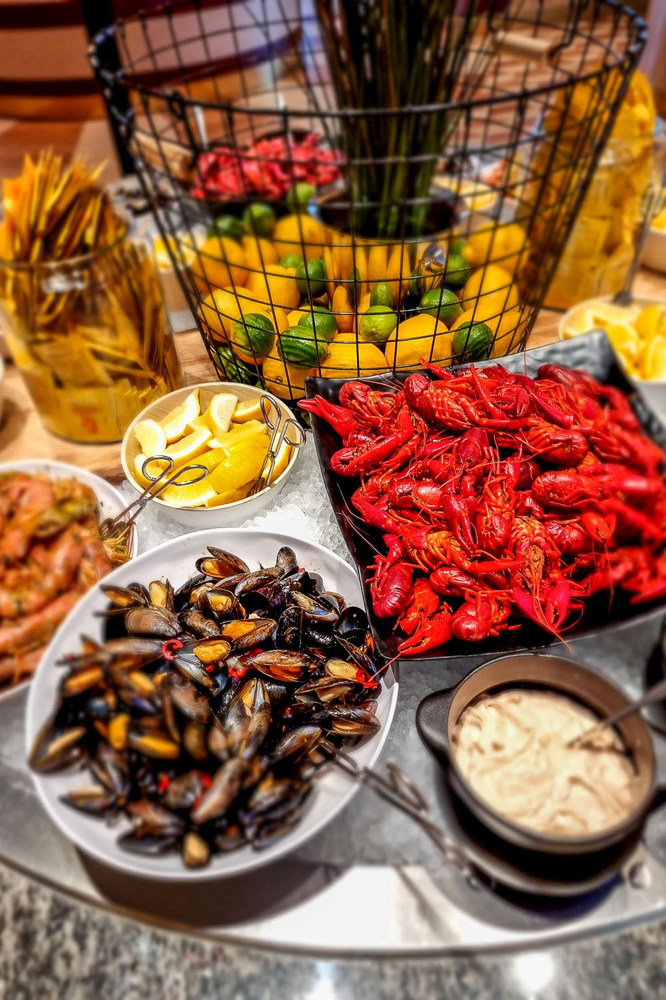

Laivan kannella on hetki, jolloin ihminen kohtaa mikrotaloustieteen
alastomimman totuuden: lautasella oleva kuudes nakki ei maksa mitään.

En ole tämän alan kokemusasiantuntija. Kävin Tallinnassa ensimmäisen
kerran vasta 2019, koska elin pitkään siinä uskossa, että se on yhä
Neuvostoliitto. Varsinaisen sivistykseni seisovan pöydän äärellä sain
Ruotsin-laivalla, missä vanhempani vetivät katkarapuähkyn sellaisella
vakaumuksella, että muistan sen yhä. Pöytä oli runsas, lautaset pieniä
ja vanhempieni katse kirkas. Siellä opin, että buffet on paikka, jossa
tavallinen ihminen tekee taloustieteellisiä päätöksiä nopeammin kuin
osaa ne perustella.

Suvussani on kuitenkin yksi henkilö, joka on nostanut tämän taidon
teoriaksi. Serkkuni on sukumme soveltavan mikrotalouden edelläkävijä.
Hänellä on buffetista oppi, jonka hän esittää joka kerta samalla
tyyneydellä: kun hän käy seisovassa pöydässä, ravintola jää tappiolle.

Kohtelen tätä väitettä sillä kunnioituksella, jonka se ansaitsee. Se on
selkeä, se on rohkea ja se on lausuttu ääneen, mikä on enemmän kuin
useimmat taloustieteilijät uskaltavat tehdä ennusteilleen. Tarkastellaan
sitä siis vakavasti.

## Syöjän ongelma

Kun pääsymaksu on maksettu, se on uponnut kustannus. Mennyttä rahaa ei
syömällä saa takaisin, koska se on jo ravintolan tilillä. Tästä
huolimatta jokainen meistä on joskus kuullut itsensä sanovan: nyt syön
rahani takaisin. Lause on uponneen kustannuksen harhan harjoittamista
omalla haimalla.

Talousteoria antaa silti syöjälle selkeän ohjeen. Koska seuraavan
annoksen rajakustannus on nolla, kannattaa syödä siihen pisteeseen,
jossa viimeisen suupalan rajahyöty putoaa nollaan. Taloustiede kutsuu
sitä optimaaliseksi ratkaisuksi. Lääketiede käyttää toista sanaa.
Rationaalinen buffetvieras pysähtyy täsmälleen siihen, missä nautinto ja
pahoinvointi kohtaavat, ja hyvä syöjä osuu siihen tarkasti.

Lautanen tuo mukanaan oman pulmansa, joka tunnetaan reppuongelmana.
Tilavuus on rajallinen ja jokaisella ruoalla on oma
arvo-tilavuussuhteensa. Leipä on tässä laskelmassa surkea sijoitus, ja
juuri siksi ravintola asettaa sen pöydän alkupäähän. Aloittelija lastaa
leipää ja häviää pelin ennen pääruokaa. Serkkuni ei koske leipään. Hän
aloittaa katkaravuista. Tämä on kurinalaisuutta, jota on vaikea olla
ihailematta.

## Ketä vastaan voitto tulee

Sitten tulee kysymys, jonka serkkuni iskulause sivuuttaa. Ketä vastaan
hän oikeastaan voittaa?

Buffetin hinta on asetettu keskimääräisen kulutuksen mukaan. Kun syöjiä
on satoja, suurten lukujen laki tekee työnsä: yksittäiset katkarapuhamstraajat ja
yksittäiset potunsyöjät keskiarvoistuvat, ja ravintola tietää
melko tarkasti, mitä ilta maksaa. Tehokas syöjä ei tässä joukossa kaada
koko bisnestä. Hän siirtää varallisuutta niiltä, jotka söivät vähän itselleen.
Teinityttö, joka otti salaattia ja yhden soijapullan, maksoi osan
serkkuni katkaravuista.

Serkkuni siis voittaa. Hän vain voittaa väärän vastustajan. Ravintolan omistaja 
hymyilee kassalla, ja kevyt syöjä maksaa laskun.

Ravintola tietää tämän ja suojautuu. All-you-can-eat houkuttelee
luokseen raskaan hännän, ja se on haitallista valikoitumista risteliyaluksen mittakaavassa. Bisnes vastaa kitkalla: pienet lautaset, sopivan kaukana
sijaitseva katkarapupiste, halvat hiilihydraatit etualalla ja kunnon kate
juomissa. Voitto ei synny ruoasta vaan janosta.

## Se yksi kerta, kun teoria toteutui

On kuitenkin yksi tilaisuus, jossa serkkuni iskulause toteutui
kirjaimellisesti. Ne olivat minun hääni.

Tarjoilun mitoitus laskettiin huolellisesti, normaalin keskimääräisen
kulutuksen mukaan. Voileipäkakkua tilattiin sen verran kuin tavanomainen
vierasjoukko syö. Laskelma oli moitteeton yhtä yksityiskohtaa lukuun
ottamatta. Se unohti, että samasta suvunhaarasta saapuisi toistakymmentä
hyväruokaista vierasta, serkkuni heidän joukossaan.

Tässä piilee koko juju. Häät ovat pieni, keskenään korreloitunut otos. Suurten
lukujen laki tarvitsee paljon vieraita tasoittaakseen ääripäät, ja sadan
hengen juhlassa sitä turvaa ei ole. Toteutunut otos oli itsessään se
raskas häntä ja se häntä oli vielä korreloitunut.

Silloin harmitti. Kakun määrä oli laskettu juhliin ja se loppui ennen
kuin osa vieraista ehti pöytään. Myöhemmin asia on naurattanut useammin
kuin osaan laskea.

## Opetus

Buffet kestää raskaan syöjän, koska suurten lukujen laki kantaa sen.
Häät kaatuvat samaan syöjään, koska siellä ei ole tarpeeksi suuria numeroita. Sama
ihminen on vaaraton Cinderellalla mutta tuhoisa sukujuhlassa.

Jos siis joskus haluaa nähdä ravintolan jäävän tappiolle, risteily on
väärä paikka. Oikea paikka on yksityistilaisuus, jonka asiakasprofiilia kukaan ei
muistanut mallintaa oikein. Ja jos sellaista juhlaa sattuu
suunnittelemaan, kannattaa laskea vieraat nimeltä ja merkitä erikseen
ne, jotka tulevat suvun siitä haarasta, jolla on teoria -- ja varata heille oma kakku.