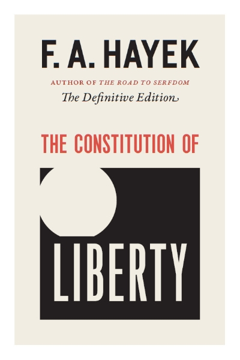

Hayekin essee *Why I Am Not a Conservative* (1960) on ennen kaikkea epistemologinen kannanotto: miten suhtautua muutokseen ja perinteeseen, kun tietää oman tietonsa rajallisuuden. Otsikkoni on ehkä turhan rohkea. En ole Hayekin tasoinen ajattelija, eikä minun positioni ole kiinnostava. Mutta kirjoittaminen on ajattelemista ja oma bloggaamiseni hyväntahtoista trollaamista.

Hayek kirjoitti esseen osin siksi, että sana *liberal* oli hänen aikanaan amerikkalaisessa käytössä jo kääntynyt tarkoittamaan miltei päinvastaista kuin mitä hän tarkoitti. Konservatiivin leimaa hän ei myöskään halua, koska se sitoo position nykytilan puolustamiseen.

Esseetä luetaan usein poliittisena itsemäärittelynä, eräänlaisena leirinvalintana. Se on kuitenkin kiinnostavin epistemologisena tekstinä. Sen ydin on kysymys siitä, miten ihminen pitää kiinni omista vakaumuksistaan ja suhtautuu muutokseen, kun hän samalla myöntää tietävänsä vähemmän kuin haluaisi. Tästä näkökulmasta essee on säilynyt merkityksellisenä, vaikka sen poliittinen sanasto on osin vanhentunut.

## Miten Hayek määrittelee konservatismin

Hayekin määritelmä konservatismista on tahallisen rajaava. Konservatismi on hänelle asenne, joka määrittyy pelkästään suhteessa vallitsevaan muutokseen: se vastustaa nykyistä liikettä mutta ei osoita suuntaa. Tunnetussa vertauksessaan hän kuvaa konservatismia jarruna. Se voi painaa jarrua, mutta ei osaa kääntää rattia suuntaan, johon pitäisi mennä. Tästä seuraa hänen mukaansa konservatismin pohjimmainen opportunismi. Koska sillä ei ole omia periaatteita, sisältö riippuu täysin siitä, mitä kulloinkin sattuu olemaan vallalla. Eilisen radikaali voi olla tämän päivän konservatiivi, koska maailma on muuttunut. Ja vice versa.

Tämä on osin karikatyyri. Burken kritiikki Ranskan vallankumousta kohtaan nojasi siihen, että abstrakteista periaatteista johdettu täydellinen yhteiskuntasuunnitelma sivuuttaa sen kasaantuneen kokemuksen, jota instituutiot kantavat. Oakeshott muotoili saman vielä selvemmin. Oakeshottin konservatismi on lähinnä taipumus: halu arvostaa olemassa olevaa, tuttua, koeteltua ja meidän omaamme sillä perusteella, että sen tuhoamisen kustannukset ovat tuntemattomia. Tällainen konservatismi on vain suhtautumistapa epävarmuuteen.

Kun konservatismi luetaan näin, Hayekin positio mutkistuu. Oakeshottilainen varovaisuus, tuntemattoman kustannuksen kunnioitus, on hyvin lähellä sitä, mitä Hayek itse sanoo spontaanista järjestyksestä ja hajautetusta tiedosta. Vastaväite ei kumoa Hayekia, vaan herättää kysymyksen: jos hänen epistemologiansa sisältää konservatiivisen pohjavireen, missä kulkee se raja, joka erottaa hänet konservatiivista?

## Pakko, periaatteet ja pluralismi

Hayekin vastaus liittyy voimankäyttöön ja pakottamiseen. Konservatiivi ei hänen mukaansa vastusta pakkoa sinänsä. Konservatiivi vastustaa pakkoa silloin, kun sitä käytetään väärään tarkoitukseen, mutta hyväksyy sen mielellään silloin, kun se palvelee oikeaksi koettua päämäärää. Liberaali Hayekin merkityksessä vastustaa mielivaltaista pakkoa riippumatta siitä, mihin sitä käytetään. Erottelu koskee viime kädessä suhdetta valtaan. Suhde muutokseen on tässä toissijainen.

Tähän liittyy esseen toinen kantava ajatus, suvaitsevaisuuden periaate. Liberaali eroaa konservatiivista siinä, ettei hän pelkää antaa toisille vapautta sellaisissakaan asioissa, joita hän itse paheksuu. Moraaliset vakaumukset kuuluvat hänelle yksityisen elämän ja vapaaehtoisen sopimisen alueelle. Niiden ei pidä olla valtion pakkokoneiston kohteita. Konservatiivi puolestaan taipuu käyttämään julkista valtaa oman moraalinäkemyksensä pakottamiseen, jos pitää sitä oikeana. Tässä on se varsinainen vedenjakaja.

Periaatteen ja opportunismin erottelu kytkeytyy tähän. Tässä periaate toimii kuin sitoutumismekanismi. Se on sama rakenne, jolla Odysseus sidotaan mastoon tai Gyökeres dumppaa tyttöystävänsä: päätös tehdään etukäteen ja viedään pois oman tulevan harkinnan ulottuvilta juuri siksi, ettei siihen hetkeen luoteta, jossa houkutus on suurimmillaan. Periaate sitoo sen varalta, että huomenna voi keksiä keksin liian hyvän syyn poiketa. Opportunisti skippaa tämän ja säilyttää harkintavallan jokaisessa yksittäistapauksessa. Periaate on sitoumus sääntöön, joka sitoo silloinkin, kun lopputulos ei miellytä. Voltairen läpän vakiintuneen kanonisen suomennoksen mukaan: "En ole samaa mieltä kanssasi, mutta puolustan kuolemaani saakka oikeuttasi sanoa se." Liberaalin position kova ydin on juuri valmius pitää kiinni säännöstä silloin, kun sääntö tuottaa tuloksen, jota itse vieroksuu. Vain tällainen sääntö suojaa myös niitä, joiden vakaumukset poikkeavat niistä joita itse pidän mieleisinä. Opportunisti taas arvioi jokaisen tapauksen erikseen toivotun lopputuloksen valossa ja menettää näin koko pakkoa rajoittavan periaatteen. Tämä erottelu on Hayekin esseen kestävin anti. Se ei vanhene, eikä riipu siitä, miten milloinkin puolueet sijoittuvat poliittisen kompassin nelikenttään.

## Nationalismi ja protektionismi rakenteellisena kollektivismina

Hayek liittää konservatismiin myös taipumuksen nationalismiin, ja hän pitää nationalismia yhtenä kollektivismin juurena. Taloudellinen nationalismi, protektionismi sen selvimpänä muotona, on rakenteeltaan sama operaatio kuin sosialismi, vaikka retoriikka on päinvastainen. Molemmat korvaavat hintojen spontaanin järjestyksen poliittisella ohjauksella. Molemmat olettavat, että keskitetty toimija voi tietää hajautettua prosessia paremmin, mihin resurssit pitäisi suunnata. Vain jakolinja ja retoriikka vaihtuvat.

Tässä näkyy hayekilaisen argumentin kaunis sisäinen johdonmukaisuus. Sama tiedonkäsittelyn ongelma, joka tekee keskussuunnittelusta mahdottoman, tekee protektionismista tehottoman. Rajan vetäminen kansakunnan ympärille ei poista laskentaongelmaa. Tässä konservatismi, joka muuten vetoaa hajautettuun viisauteen ja epäluuloon suuria suunnitelmia kohtaan, kääntyy itseään vastaaan ja hyväksyy keskitetyn ohjauksen heti, kun ohjaus tehdään oman ryhmän hyväksi. Hayekin huomio on, että kollektivismi ei ole vasemmiston yksinoikeus. Se on rakenne. Vain paidan tai lipun väri muuttuu.

## Missä Hayek jää vajaaksi

Tähän asti olen lukenut Hayekia myötäsukaisesti. On myös tarpeellista sanoa, missä argumentti jää vajaaksi. Vaikein kohta on epäsymmetria instituutioiden synnyn ja niiden ylläpidon välillä.

Hayek selittää loistavasti, miten instituutiot syntyvät. Spontaani järjestys, kulttuurinen evoluutio ja ihmistoiminnan suunnittelemattomat tulokset ovat hänen vahvinta aluettaan, ja ajatus on aidosti syvällinen. Hän on heikommalla kysymyksessä siitä, miten instituutioita ylläpidetään ja milloin niitä ja niiden sääntöjä saa ja pitää muuttaa. Instituutiot ovat evoluution tulosta, ja jos me todella tiedämme vähemmän kuin luulemme, hänen omaan epistemologiaansa sisältyy konservatiivinen päätelmä: todistustaakka on muutoksen ajajalla. Konservatiivi pääsee vähemmällä. Tämä ei ole status quon palvontaa, vaan epistemologinen kanta. Koska kykymme ennakoida muutoksen seurauksia on rajallinen, muutoksen perustelu vaatii enemmän kuin nykytilan säilyttäminen.

Hayek tunsi tämän kiusallisen jännitteen, ja ainakin itse luen sen esseessä tiettynä vaivaantuneisuutena. Hän halusi pitää etäisyyttä sosiaalikonservatismiin, mutta tarvitsi silti perinteen ja koetellun käytännön evoluution pohjaksi. Hän ei oikein ratkaissut kysymystä siitä, milloin perinteen kunnioitus muuttuu pelkän inertian puolusteluksi. Oakeshott vastasi tähän paremmin juuri siksi, että taipumus oli hänelle position kova ydin: muutos on aina mahdollinen, mutta sen on kannettava todistustaakka. Ylläpito on spontaania järjestystä suojelevaa varovaisuutta.

## Johtopäätökset: miksi minäkään en ole konservatiivi

Otsikon varastin Hayekilta tarkoituksella. Olen lukenut esseen läpi myötämielisenä ja huomaan jakavani melkein koko sen konservatiivisen vaiston. Arvostan perinteitä. Pidän koeteltua tapaa viisaampana kuin miltä se usein äkkinäiselle näyttää. Asetan todistustaakan uudistajalle. Näillä mittareilla olen lähempänä konservatiivia kuin radikaalia.

Yksi kysymys silti erottaa. Saako oikeaksi katsottu päämäärä oikeuttaa pakkovallan? Konservatiivi vastaa kyllä, kun päämäärä on mieleinen. Minä vastaan *fuck no*, vaikka päämäärä olisi minulle mieleinen. Tähän ero tiivistyy, ja se on tärkeämpi kuin asenne tradition arvostamiseen tai miten suhtautua muutokseen.

Raja näkyy siinä, mitä perinteelle tapahtuu, kun se kohtaa yksilön vapauden ja uuden tiedon. Konservatiiville traditio on majakka, jonka suojelemiseksi valtion valtaa voi käyttää. Minulle se on työkalu: menneisyyden kiteyttämää tietoa, joka mahdollistaa rauhallisen rinnakkaiselon ilman keskusohjausta. Työkalua saa ja pitää korjata, majakkaa täytyy vartioida. Siksi hayekilainen liberaali suostuu elämään sellaistenkin sääntöjen mukaan, joiden lopputulosta hän ei voi ennustaa eikä aina hyväksyä.

Pelkkä halu painaa jarrua on dorkaa ja karmeeta. Oakeshottilainen varovaisuus antaa jarrulle älyllisen oikeutuksen, ja vain periaatteellisuus estää sitä muuttumasta mielivallan välineeksi. Yhteiskunnan toimivuutta ei pidä mitata sillä, kuinka hyvin se pysyy samana. Sitä pitää mitata säännöillä, jotka antavat meidän etsiä parempaa silloinkin, kun tulee oma vuoro hävitä.

Tämä tekee oloni toisinaan vaivaantuneeksi, ja juuri siksi pidän siitä kiinni.
