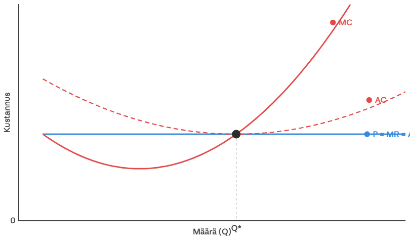

Kun [Tyler Cowen](https://tylercowen.com) julkaisi [uuden teoksensa](https://tylercowen.com/marginal-revolution-generative-book/), se oli ladattavissa PDF:nä, ePubina ja markdown-tiedostona. Kiinnostavin näistä on markdown-versio: pelkkää tekstiä, otsikoita ja linkkejä. Ratkaisu näyttää pieneltä tekniseltä yksityiskohdalta, mutta se on osa itse argumenttia.

Cowenin ajatus on, että lukeminen ei ole enää pelkkää lineaarista vastaanottamista. Yhä useammin tekstiä luetaan keskustelemalla sen kanssa: kysymällä, tiivistämällä, vertailemalla, seuraamalla sivupolkuja. Siksi hän puhuu "generatiivisesta kirjasta". Jokainen sana on hänen kirjoittamansa, mutta lukijaa rohkaistaan lataamaan teksti, syöttämään se kielimallille ja käyttämään tekoälyä oppimisen välineenä. Perinteinen lukeminen säilyy yhtenä vaihtoehtona, mutta ei enää ainoana.

Juuri siksi markdown on kiinnostava valinta. Se on ihmiselle luettavaa tekstiä, mutta samalla myös koneelle helppoa jäsentää. PDF on erinomainen ulkoasun säilyttämiseen. Markdown on parempi silloin, kun sisältöä halutaan käsitellä, pilkkoa, kommentoida ja kysellä. Kun kirjaa ei enää vain lueta vaan sen kanssa myös keskustellaan, .md alkaa näyttää luontevalta pääformaatilta.

Kirjan aihe on marginalistinen vallankumous: 1800-luvun lopun murros, jossa kolme toisistaan riippumatonta ajattelijaa päätyivät samaan oivallukseen. Taloudellinen arvo määräytyy siitä, miten paljon *seuraava yksikkö* hyödyttää tai maksaa. Klassinen esimerkki on arvon paradoksi: miksi vesi on halpaa ja timantit kalliita, vaikka vesi on elämälle välttämätöntä? Koska kyse on seuraavan lasillisen tai seuraavan timantin arvosta. Kun vettä on runsaasti, yhden lisälasillisen tuoma hyöty on pieni. Tästä havainnosta rakentui moderni mikrotaloustiede.

Myös formaattivalinta on marginalistinen kysymys. Missä on lisäarvo nyt? Onko se taitossa, typografiassa ja valmiiksi paketoidussa objektissa, vai siinä, että teksti on mahdollisimman kitkattomasti luettavissa myös koneelle? Informaatiohyödykkeissä kopioinnin ja jakelun rajakustannus on jo lähellä nollaa. Kun jakelu ja tekstin jäsentäminen ovat molemmat lähes ilmaisia, arvo kasautuu siihen mikä on niukkaa: kirjoittajan nimeen, ajatuksiin, yleisöön ja luottamukseen.

Voit kokeilla itse: [lataa teksti](https://tylercowen.com/marginal-revolution-generative-book/) ja kysy kielimallilta vaikkapa "Miten Jevonsin ja Mengerin marginalismi eroavat toisistaan?" tai "Miten tekoäly muuttaa taloustieteen tutkimusmenetelmiä?"
