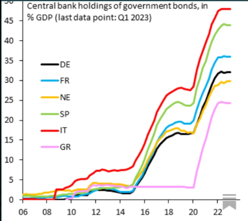

> *"Governments and voters respond to incentives too. That is why governments sometimes default on loans and other promises that they have made."*
>
> — Thomas Sargent, UC Berkeley, 2006

Matti Viren nosti hiljattain esiin kuvan, joka kertoo paljon euroalueen poliittisesta taloudesta: keskuspankkien hallussa oleva osuus euroalueen valtionveloista on kasvanut finanssikriisin jälkeen nopeasti, erityisesti EKP:n osto-ohjelmien seurauksena. Useissa maissa keskuspankit omistavat nykyisin merkittävän osan valtionvelasta — Italiassa ja Espanjassa osuudet ovat suurimpien joukossa.

Kuva havainnollistaa klassista kannustinongelmaa.

## Moral hazard rakenteessa

Markkinakuri toimii periaatteessa yksinkertaisella mekanismilla: jos valtio velkaantuu liikaa tai sen finanssipolitiikan uskottavuus heikkenee, sijoittajat vaativat korkeampaa korkoa. Korkeampi korko nostaa velanhoitokuluja ja pakottaa lopulta sopeutukseen.

Eurokriisi kuitenkin osoitti myös markkinakurien epävakauden. Riskipreemiot voivat pysyä pitkään hyvin matalina ja nousta kriisitilanteessa äkillisesti, mikä voi johtaa itseään ruokkivaan velkakriisiin. Tästä syystä monet taloustieteilijät ovat pitäneet keskuspankin roolia velkakirjamarkkinoiden viimekätisenä vakauttajana perusteltuna.

EKP:n laajat joukkovelkakirjaostot muuttivat kuitenkin velkakirjamarkkinoiden dynamiikkaa merkittävästi. QE-ohjelmien ja PEPP:n myötä keskuspankista tuli keskeinen ostaja euroalueen valtionvelkakirjamarkkinoilla. Tällöin korkopreemio ei enää heijasta pelkästään luottoriskiä, vaan myös rahapoliittisia interventioita.

Markkinakurin rooli heikkenee, kun velkakirjamarkkinoilla toimii institutionaalinen ostaja, jonka motiivit eivät ole puhtaasti riskiperusteisia.

Tämä ei välttämättä ole ongelma, jos poliittinen päätöksenteko on markkinoita kurinalaisempaa. Euroalueen institutionaalinen rakenne tekee tästä kuitenkin epävarmaa: jäsenvaltioilla on täysi budjettisuvereniteetti, mutta velkarahoituksen hinta määräytyy osittain yhteisen rahapolitiikan kautta.

Kannustin löysempään finanssipolitiikkaan on siis ainakin osittain rakenteellinen.

## Disinsentiivi ei tarkoita insentiivien puuttumista

Viren puhuu "disinsentiivistä" finanssikurille. Täsmällisemmin sanottuna finanssikurin kustannus on laskenut suhteessa vaihtoehtoon. Kun velkaraha on halpaa ja keskuspankki toimii markkinoiden vakauttajana, sopeutustoimien poliittinen kustannus kasvaa suhteessa niiden välittömään hyötyyn.

Riskipreemiot eivät ole kadonneet kokonaan — Italian valtionlainojen korot ovat edelleen Saksan korkoja korkeammat — mutta keskuspankin interventiot ovat rajanneet niiden äärimmäisiä liikkeitä.

Tämä muuttaa finanssipoliittisten päätösten kannustimia.

## Eurobondit: eri diagnoosi

Tässä kohtaa astuu kuvaan toinen keskustelu. Olivier Blanchard ja Angel Ubide ovat ehdottaneet yhteisiä eurooppalaisia joukkovelkakirjoja ratkaisuksi euroalueen pirstoutuneille velkakirjamarkkinoille. Heidän näkemyksensä mukaan euroalueelta puuttuu syvä ja likvidi yhteinen turvallinen velkainstrumentti, mikä heikentää rahoitusmarkkinoiden toimintaa ja euroalueen kansainvälistä asemaa.

Hanno Lustig on esittänyt tähän toisenlaisen näkökulman. Hänen mukaansa euroalueen keskeinen ongelma ei ole velkakirjamarkkinoiden pienuus vaan riskien hinnoittelun heikkeneminen. Jos markkinat olettavat, että euroalueen instituutiot eivät salli valtioiden maksukyvyttömyyttä, osa luottoriskistä siirtyy käytännössä veronmaksajille.

Eurobondit eivät tällöin poistaisi ongelmaa vaan tekisivät riskien yhteisvastuullisuudesta eksplisiittistä.

Viren tiivistää olennaisen: jos velkakirjamarkkinoilla riskit eivät heijastu hintoihin, markkinoiden syventäminen ei yksin ratkaise ongelmaa.

## Exit-kysymys

Keskuspankin tasepolitiikka luo myös polkuriippuvuuden. EKP:n taseen purkaminen ei ole neutraali operaatio: jos suuri määrä valtionvelkaa palautuu markkinoille lyhyessä ajassa, korkopreemiot voivat nousta nopeasti.

Japania käytetään usein vertailukohtana. Siellä keskuspankki omistaa jo yli puolet valtionvelasta, eikä exit-strategia ole käytännössä keskustelun keskiössä.

Euroalueella tilanne on kuitenkin institutionaalisesti erilainen. Japanissa keskuspankki ja finanssipolitiikka kuuluvat samaan poliittiseen kokonaisuuteen. Euroalueella taas rahapolitiikka on yhteinen, mutta finanssipolitiikka hajautettu useille valtioille, joilla on erilaiset velkatasot ja poliittiset kannustimet.

Italia ei ole Saksa — mutta rahapolitiikka on sama.

## Kuka maksaa?

Lopulta kysymys palaa kannustimiin. Keskuspankin tasepolitiikka voi vakauttaa markkinoita kriisissä, mutta samalla se muuttaa finanssipolitiikan kannustinrakennetta.

Euroalueen rahapolitiikka on viime vuosikymmenellä vakauttanut velkakirjamarkkinoita merkittävästi. Samalla se on kuitenkin vähentänyt markkinakurien roolia finanssipolitiikan ohjaajana.

Kysymys ei ole siitä, oliko kriisitoimille tarvetta — vaan siitä, millainen institutionaalinen järjestelmä niiden seurauksena syntyy. Tässä keskustelussa euroalue on edelleen kesken.