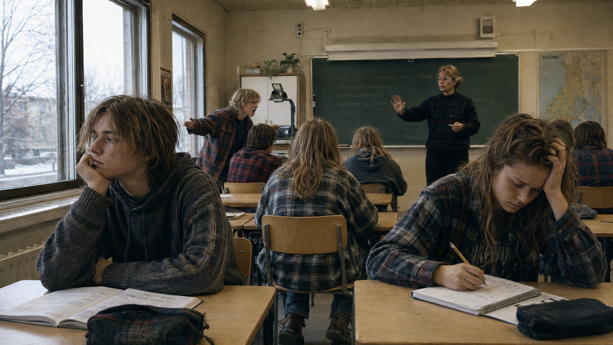

Helsingin Sanomien 14.5.2026 julkaisemassa haastattelussa 15-vuotias Emil Lumme, Käpylän ruotsinkielisen Kottby grundskolanin yhdeksäsluokkalainen, esittää havainnon, joka ansaitsee tulla otetuksi vakavasti:

> "Koko koulupäivän sisällön pystyisi opiskelemaan itse tunnissa kotona. Tekisi mieli lintsata, niin pystyisin oppimaan ja keskittymään paremmin. Se on aivan hirveää."

Ja edelleen:

> "Ilmeisesti tasa-arvoa on, että laitetaan kaikki samaan huoneeseen. Sitten siellä kiroillaan, juostaan ulos luokasta kavereita moikkaamaan, sekoillaan kännykällä ja sanotaan opettajalle tai toisille, että tapa ittes. Todella huonolle käytökselle ei ole mitään seurauksia, opettajat eivät edes heitä pois luokasta."

Lumpeen mukaan koulussa myös kiusataan: hän kertoo kuulevansa viikoittain olevansa nörtti, ja sama tilanne on jutun mukaan hänen rinnakkaisluokkien kavereillaan, jotka  pärjäävät hyvin koulussa.

Lahjakkaat tylsistyvät ja menettävät motivaationsa. Hitaammin oppivat lannistuvat. Häiriköinti tekee opiskelusta vaikeaa kaikille.

Lumme kuvaa opetuksen tahtia: 

> "Koulussa katsomme joskus vain 1–2 diaa tunnissa. Mietin usein, että miten voi olla näin hidasta, tulen ihan hulluksi siitä. Kun olin viikon poissa koulusta, pystyin opettelemaan neljässä tunnissa kotona ne asiat mitä sinä aikana oli koulussa ollut."

## Kaksi peliä

Yläasteen luokaltani jatkoivat lukioon minun lisäkseni vain tytöt. Tunneilla en viitannut juuri koskaan, vaikka opettajat aina valittivat, että "tunneilla sinun pitäisi olla aktiivisempi, kun tiedän että osaat". Kysymykseen siitä, pitäisikö tuntiaktiivisuuden olla ollenkaan osa arvosanaa en osaa ottaa kantaa. Mutta tässä on kaksi eri peliä. Viittaamalla olisi ehkä saanut paremman numeron todistukseen. Iisalmessa sillä ei ollut juuri merkitystä, koska kaupungin ainoaan lukioon riitti suunnilleen kasin keskiarvo. Tuntiaktiivisuudella olisi varmasti saanut vielä enemmmän vittuilua vertaisryhmältä. Rationaalinen toimija optimoi soisaalisen pelin: jos tuntiaktivisuudella saa paremman numeron todistukseen, mutta samalla ottaa riskin siitä, että joutuu kiusatuksi ryhmässä, jonka kanssa viettää viisi päivää viikossa kolmen vuoden ajan valinta on aika selvä.

Matikan ja äikän otin tosissani. Nuissa aineissa tein sen verran, mikä kiinnosti ja riitti ysiin. Teknisessä työssä yritin myös parhaani, mutta paras arvosana oli seiska. Sw oli poikkeus muihin aineisiin: viiteryhmä vittuili niiile, jotka eivät osannneet. 

## Ei uusi ilmiö

Lumpeen hienosti kuvaama dynamiikka ei ole 2020-luvun ilmiö. Pellet, nörtit ja seuraamuksetta jäävät häiriköt olivat luokkahuoneissa samalla tavalla 80- ja 90-luvulla. Ilmiö on saattanut vahvistua, mutta sen rakenteelliset juuret ovat olleet olemassa jo aiemmin.

Pisa-tutkimusten valossa peruskoulu epäonnistuu erityisesti lahjakkaimpien koulutuksessa: suomalaisten paras neljännes on lähempänä huippumaiden toiseksi parasta kvartaalia kuin parasta. 

Tasoryhmiä vastustetaan tyypillisesti sillä, että ne leimaavat heikommin pärjääviä. Argumentti voi olla ihan perusteltu. Suomen peruskoulussa oli tasokursseja vuoteen 1985 asti, ja niistä luovuttiin osin siksi, että työväenluokan pojat olivat alimmilla tasoilla yliedustettuina, eikä jako aina perustunut todelliseen osaamiseen. Tasoryhmät voivat toteutuksesta riippuen lisätä epätasa-arvoa.

Mutta Lumpeella on argumentille terävä vastaus:

> "Ei ole niin, että vain jakamalla oppilaat ryhmiin tason mukaan osalle syntyy identiteetti, että he olisivat huonoja. Kyllä sama tapahtuu myös tasapäistävässä luokassa, jossa osa oppilaista näkee, miten he saavat suurella työllä seiskan ja toiset kympin tuskin tekemättä mitään. Se vasta epämotivoivaa onkin."

Pointti kääntää keskustelun oikeaan suuntaan. Leimoja syntyy kaikenlaisissa järjestelmissä, mutta oikeampi kysymys on, että kenelle ja millaiset seuraukset niillä on. Tasapäistävä luokka ei poista tasoeroja. Hitaammin oppiva näkee koko ajan, miten luokkatoveri saa kympin ilman sen suurempaa työtä. Nopeammin oppivan aika kuluu odottamiseen. Identiteetit "huono" ja "hyvä" syntyvät vertailusta viiteryhmään. Kilpailu on etenkin pojille luontaista.

## Lumpeen kysymys

Lumme tiivistää lopuksi:

> "On lapsellista ja tyhmää ajatella, että me kaikki oppilaat olisimme samanlaisia. Kysymykseni poliitikoille on, että kenelle tämä on tasa-arvoa?"

Kysymys on harvinaisen oivaltava. Lahjakkaat tylsistyvät, hitaammat lannistuvat, sekoilijat eivät opi mitään ja häiritsevät muita.

Erottelu yhdenvertaisuuden ja tasa-arvon välillä on hyvä huomio. Sama kohtelu kaikille ei ole sama asia kuin sama mahdollisuus oppia. 

Lumme esittää myös konkreettisen ehdotuksen: erityisopettajat ovat nykymallissa olemassa siksi, että he tukevat heikommin pärjääviä. Mutta entäpä jos he pystyisivät tukemaan myös lahjakkaita? Resurssi on jo olemassa. 

## Mitä koulu oikeastaan palkitsee?

Nopealle oppilaalle rationaalinen strategia on olla hiljaa, tehdä minimi ja opetella asiat muualla. Hitaammin oppivalle se voi olla suojata itseään roolilla: parempi olla häirikkö kuin julkisesti huono. Opettajan strategia on selviytyä tunnista.

Tämä on rikkinäinen kannustinrakenne. Se rankaisee oppimishalua sosiaalisesti, jättää vaikeuksissa olevat oppilaat huonoon asemaan ja antaa häiriköille veto-oikeuden luokan työrauhaan. Lumpeen kysymykseen on siksi pakko vastata: tällainen tasa-arvo ei näytä palvelevan oikein ketään.