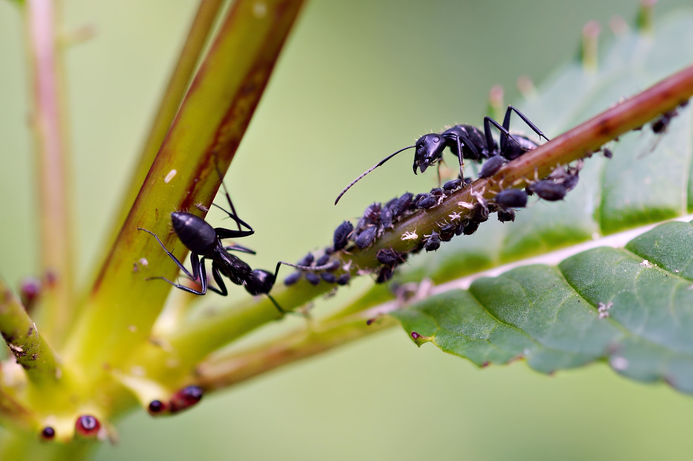
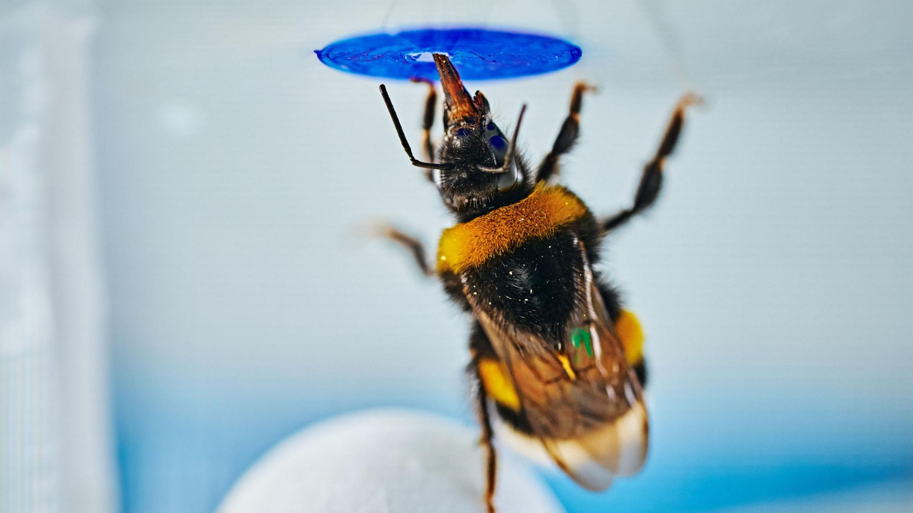

Tunnustan heti alkuun: rakastan muurahaisia. Kekomuurahaisia, hevosmuurahaisia, sokerimuurahaisia. Mutta myös kimalaisia, mehiläisiä, ampiaisia, koko sitä pörisevää ja kuhisevaa porukkaa. Myönnän myös, että ne näyttävät kommunisteilta – yhteinen pesä, yhteinen toukkahuolto, yhteinen kuningatar, jonka hyväksi muu sakki luopuu lisääntymisestään. Enkä ole ajatuksen kanssa yksin: E. O. Wilson, ehkä maailman tunnetuin muurahaistutkija, vitsaili mielellään Marxin olleen oikeassa – sosialismi toimii, kunhan laji on oikea. Silti niissä on jotain, mikä saa minut lämpenemään, ja kesäkuun alussa Sciencessä ilmestynyt tutkimus auttaa löytämään pointin miksi.

Oulun, Helsingin ja Turun yliopistojen tutkijat (väitöskirjatutkija Akshaye Bhambore ja ryhmänjohtajana dosentti Olli Loukola) asettivat *Bombus terrestris* -kimalaiset läpinäkyvälle testiareenalle. Tutkimus *Spontaneous problem-solving in bumble bees* ilmestyi Sciencessä 4.6.2026. Ennen koetta jokainen kimalainen oppi kaksi asiaa: sininen tekokukka antaa palkkion, ja palloa voi liikutella. Sitten kukka nostettiin laatikon kattoon, kimalaisen ulottumattomiin. Ratkaisua ei opetettu. Silti moni kimalainen yhdisti palaset uudella tavalla – työnsi pallon kukan alle, kiipesi sen päälle ja ylsi palkkioon. Loukola kuvaa koetta hyönteisversioksi Wolfgang Köhlerin sata vuotta vanhasta simpanssikokeesta, jossa apinat pinosivat laatikoita ylettyäkseen kattoon ripustettuun banaaniin. Kontrollikokeilla pyrittiin sulkemaan pois sattuma, leikki ja pelkkä yritys-erehdys.

Yhden kimalaisen pää sisältää noin miljoona hermosolua. Ihmisellä niitä on noin 86 miljardia. Pienellä hermosolubudjetilla syntyi joustava, tilanteeseen sovitettu ratkaisu ongelmaan, johon kimalaisella ei ollut valmista toimintamallia ja jonka ratkaisua koejärjestäjä ei ollut opettanut. Mistään keskusyksiköstä ei kuulunut käskyä: siirrä pallo nyt kukan alle. Ratkaisu syntyi kahden aiemmin opitun asian uudesta yhdistelmästä.

Juuri siksi pidän näistä otuksista enemmän kuin kehtaan kahvipöydässä kertoa. Hayek tunnetaan markkinajärjestyksen puolustajana, mutta sama järjestysajattelu ulottui hänellä myös ihmismieleen. *The Sensory Order* (1952) kuvasi mieltä itseään luokittelevana suhteiden verkkona, jossa kukaan ei istu ohjaamossa. Kimalaiskoe ei testaa Hayekin teoriaa, mutta tekee sen perusajatuksen havainnolliseksi: tarkoituksenmukainen toiminta ei edellytä sisäistä pomoa, jolla olisi valmis suunnitelma koko toimintaketjusta.

Markkinajärjestys tämä ei tietenkään ole. Yhden kimalaisen pää ei koordinoi hajautettua yhteiskunnallista tietoa hintojen avulla. RRakenteelinen yhteys näillä kuitenkin on. Monimutkaisen ja tilanteeseen sopivan lopputuloksen taustalta ei välttämättä löydy suunnittelijaa, jolla olisi kokonaiskuva.

Tästä avautuu vitsi, joka kääntyy itseään vastaan. Kutsuin pesää äsken kommunistiselta näyttäväksi, ja niin sitä usein kuvataankin: täydellinen suunnitelmatalous, jossa jokainen tietää paikkansa. Biologi nostaisi tässä kätensä, ja syystä – pesässä on kuningattaren lisääntymismonopoli, jyrkkä kastijako ja sukulaisselektion ajama altruismi, joten libertaarista markkinautopiasta ollaan kaukana. Mutta yhtä kaukana ollaan suunnitelmataloudesta. Kuningatar ei johda pesän työnjakoa. Hän ei jaa tehtäviä, ei suunnittele ruoankeruuta, ei määrää kuka hoitaa toukat. Pesän hämmästyttävä järjestys syntyy paikallisista vihjeistä, feromoneista ja yksinkertaisista säännöistä, joita yksilöt seuraavat ilman keskuskomitean asetteman työryhmän mietintöä, väliraporttia tai jatkovalmistelua. Muurahaispesä on siis erinomainen esimerkki itseorganisoitumisesta ja surkea esimerkki keskussuunnittelusta. Rakastan muurahaisia juuri siitä spontaanista järjestyksestä, jota helposti erehdytään lukemaan kommunismiksi.

Läppä ja oppitunti kestää, kun sitä ei venytä liian pitkälle. Tarkoituksenmukainen lopputulos voi syntyä ilman suunnittelijaa, jolla olisi kokonaiskuva. Näin tapahtuu hermohteyksissä, hyönteisyhdyskunnan työnjaossa ja markkinoiden hajautuneessa koordinaatiossa, vaikka niiden mekanismit ovat keskenään erilaisia.

Tämä ei osoita, että hajautus ratkaisisi kaikki koordinointiongelmat. Se muistuttaa vaatimattomammasta ja tärkeämmästä asiasta: järjestäytynyt lopputulos ei vielä todista järjestäjästä. Ennen kuin ongelma ratkaistaan pakolla, hierarkialla tai byrokratialla, kannattaa katsoa, mitä paikallinen tieto, palaute ja keskinäinen sopeutuminen jo tekevät.

## Lähteet

Bhambore, A. A., Akmeşe, E. N., Häkkinen, E., Jussila, M. K., Kantola, J.-H. & Loukola, O. J. (2026). Spontaneous problem-solving in bumble bees. *Science*, 392(6802), 1046–1049. <https://doi.org/10.1126/science.ady1618>

Hayek, F. A. (1952). *The Sensory Order: An Inquiry into the Foundations of Theoretical Psychology*. University of Chicago Press.

Hölldobler, B. & Wilson, E. O. (1990). *The Ants*. Belknap Press / Harvard University Press. (Wilsonin "väärä laji" -sitaatin lähde.)

Köhler, W. (1925). *The Mentality of Apes*. Kegan Paul, Trench, Trubner & Co. (Klassiset simpanssikokeet, "laatikko ja banaani".)

Oulun yliopisto (2026). *Bumble bees show spontaneous problem-solving in study published in Science*. Tiedote, 4.6.2026. <https://www.oulu.fi/en/news/bumble-bees-show-spontaneous-problem-solving-study-published-science>

Verde (2026). *Kimalaiset ratkaisevat ongelmia kuin kädelliset – uusi tutkimus haastaa käsityksiä eläinten älykkyydestä*. 11.6.2026. <https://www.verdelehti.fi/2026/06/11/kimalaiset-ratkaisevat-ongelmia-kuin-kadelliset-uusi-tutkimus-haastaa-kasityksia-elainten-alykkyydesta/>
