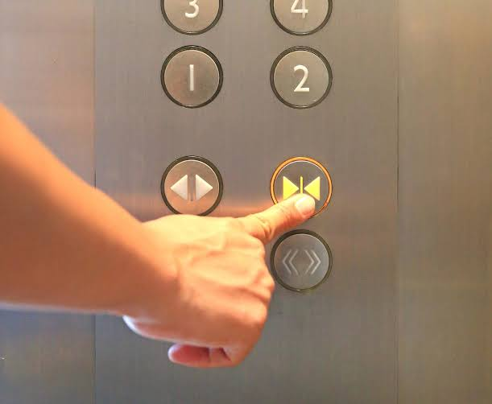

Suomalainen astuu hissiin, painaa kerroksensa nappia ja siinä se. Ovet
menevät aikanaan kiinni omalla painollaan, insinööri on suunnitellut
sopivan aukioloajan. Jos hississä ylipäätään on sulkemisnappi, sen
painaminen tuntuisi epäkohteliaalta ja hätäiseltä.

Singaporessa opin, että on toinenkin tapa. Siellä astutaan hissiin
ja painetaan oven sulkevaa nappia välittömästi. Ei kerran vaan monta
kertaa, painokkaasti, kuin ne kolme sekuntia ennen automaattista
sulkeutumista olisivat sietämättömän pitkät. Väitetään, että
aasialaisessa hississä juuri close-nappi on paneelin kulunein. Uskon sen
empimättä.

Tämä liittyy laajempaan piirteeseen, jolla on Singaporessa oma sana.
Kiasu, kirjaimellisesti pelko hävitä tai jäädä toiseksi, on eräänlainen
kaupungin käyttövoima, kärsimättömyys jäädä muista jälkeen. Siitä
kirjoitan joskus toiste, jos jaksan. Tässä riittää sen pikkuserkku.

## Rooli, joka lankeaa

Vietin työaamuni toimiston hissin aamuruuhkissa, ja niissä opin uuden
sanan omaan sanastooni. Nappiukko.

Nappiukko on se, joka sattui astumaan hissiin lähimpänä paneelia.
Kukaan ei nimeä häntä. Mikään sääntö ei määrää hänen tehtäväänsä. Mutta
sillä sekunnilla, kun hän asettuu nappien viereen, koko hissillinen
ihmisiä siirtää hänelle äänettömästi vastuun: nyt sinä painat, ja sinä
painat close-nappia jokaisen kohdalla kunnes olemme kaikki perillä.

Suomalaiselle rooli on kiusallinen monella tapaa. Ensin siksi, että
nappia ylipäätään hakataan, mikä sotii koko kasvatusta vastaan. Ja heti
perään siksi, että juuri sinut on vaieten komennettu tekemään se kaikkien
puolesta. Seisot hississä tehtävässä, johon et ole suostunut, ja
huomaat painavasi nappia kohteliaasti, koska vaihtoehto olisi seistä
tiellä ja rikkoa sääntö, jota kaikki muut pitävät itsestäänselvänä.

## Normi ilman lainsäätäjää

Tässä on se, mikä nappiukossa oikeasti viehättää. Se on kokonainen
instituutio, joka mahtuu hissiin.

Sitä ei ole kukaan säätänyt, eikä varsinkaan kukaan valvo sitä. Silti se
toimii joka aamu, luotettavammin kuin moni kirjoitettu sääntö, ja lankeaa
mekaanisesti sille, joka sattuu astumaan hissiin väärään paikkaan. Se on
spontaania järjestystä pienoiskoossa, tapa joka on syntynyt itsestään ja
jota noudatetaan ilman että kukaan osaa sanoa, milloin siitä tuli sääntö.
Hayek kirjoitti tästä paksuja kirjoja. Singaporen hissi opettaa saman
kolmessa sekunnissa, ja vielä nopeammin jos joku painaa nappia.

Me suomalaiset kollegat teimme siitä tietysti vitsin. Nappiukoksi
joutuminen oli aamun pieni kärsimys, josta valitettiin aamukahvilla, ja
sana jäi elämään meidän kesken. Se oli tapa ottaa etäisyyttä normiin,
jota emme kuitenkaan voineet olla noudattamatta. Nauroimme
close-napille ja painoimme sitä silti, koska ei meillä ollut oikein muuta
vaihtoehtoa kuin sopeutua.

## Lopuksi

En ole varma, onko nappiukko kiasua. Kiasussa kilpaillaan jostakin,
jonka toinen voi viedä, sen viimeisen paikan, osterin tai parhaan
tarjouksen. Hississä ei kilpailla mistään. Siellä vain ei siedetä
hukattua sekuntia, ei edes silloin kun sillä sekunnilla ei tee mitään.

Ehkä se on kiasun serkku. Sama kärsimättömyys, eri kohde. Ja niin kuin
serkut yleensä, se paljastaa suvun piirteet vähän selvemmin kuin
sukulainen itse.

Kotona Oulussa nappiukon instituutio ei tosin pääse edes syntymään.
Hissin maksimihenkilömäärä on yleensä neljä henkilöä ja massarajoitus
320 kg. Massarajoitus tulee useammin ensimmäisenä vastaan. Ja empiirinen
havainto (ei tarkka eikä dokumentoitu): hissin mediaanimatkustajamäärä
Oulussa on 1, mutta tunnen taloni ja veikkaisin keskiarvon 1,1:ksi. Joka
tapauksessa viiden kerroksen talossa hissimatka on niin lyhyt, että
nappiukon työura jää väistämättä lyhyeksi. Spontaani järjestys tarvitsee
toistoa ja kestoa, ja meidän hissimatkamme ovat armollisesti liian
lyhytkestoisia tuottamaan omaa nappiukkoaan. Sen minkä Singapore opettaa
pilvenpiirtäjän mitalla, Oulu jättää kokonaan opettamatta.
