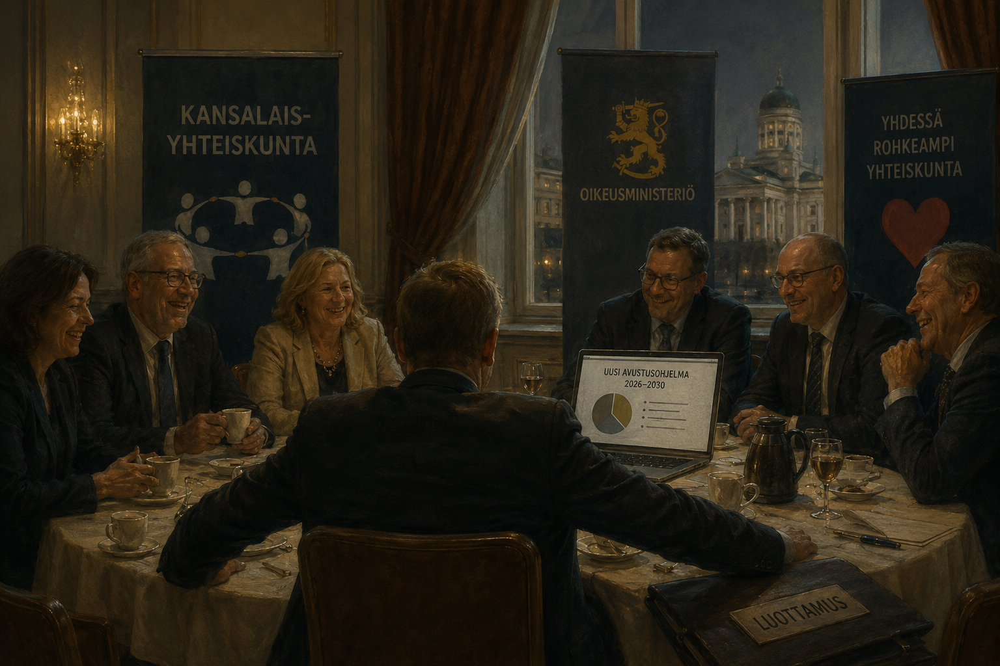

Järjestöjen valtionrahoitus nousee julkisuudessa esiin aika ajoin, lähes aina moraalisessa kehyksessä. Toisaalla puhutaan heikoimpien auttamisesta, toisaalla verorahojen tuhlaamisesta. Kumpikin kehys ohittaa kiinnostavamman kysymyksen. Miksi rahoitusrakenne, joka tuottaa toistuvasti tehottomuutta ja toisinaan tarpeettomilta vaikuttavia toimia, pysyy pystyssä, vaikka kukaan ei ole tällaista tietoisesti rakentanut? Vastaus on kannustinrakenteessa. Lopputulos syntyy melko luotettavasti riippumatta siitä, ketkä järjestelmää kulloinkin pyörittävät.

## Organisaatio puolustaa budjettiaan

Niskasen byrokratiamalli [@niskanen1971] ei siirry järjestökenttään sellaisenaan. Järjestö ei ole virasto, eikä se ole monopolituottaja suhteessa rahoittajaansa samalla tavalla kuin valtion laitos. Mallin perusoivallus kuitenkin siirtyy: jos organisaation arvostus, henkilöstö, johdon asema ja jatkuvuus riippuvat ennen muuta budjetin koosta, organisaatio alkaa käyttäytyä budjettiaan puolustavana toimijana. Tuotetun hyödyn ja saadun määrärahan yhteys jää löyhäksi, koska yleishyödyllisen toiminnan tuotos on usein vaikeasti mitattava ja osin toimijan itsensä määrittelemä.

Tätä kutsutaan myös tehtävän liukumaksi, *mission drift*. Järjestö perustetaan ratkaisemaan jokin ongelma, mutta kun rahoitus, henkilöstö ja asema vakiintuvat, organisaation oma jatkuvuus alkaa vähitellen syrjäyttää alkuperäisen päämäärän. Väline muuttuu itseisarvoksi.

Sama mekanismi selittää myös valtionhallinnon sinekyyrimäisia tehtäviä. Johtaja ei yleensä saa henkilökohtaista palkintoa siitä, että hän lakkauttaa oman organisaationsa tarpeettoman päällikköportaan. Säästö näkyy abstraktina lukuna budjetissa, mutta päätöksen kustannus näkyy heti: hankalana henkilöstöprosessina, konfliktina, mainehaittana, poliittisena riskinä ja huonompana työilmapiirinä. Niin kauan kuin budjetti kantaa, helpoin ratkaisu on jättää rakenne ennalleen.

Tämä ei edellytä korruptiota eikä edes erityistä kyynisyyttä. Riittää, että säästön hyöty ja karsimisen kustannus osuvat eri paikkoihin. Sama pätee järjestökenttään. Jos organisaatio purkaa omaa hallintoaan, se samalla pienentää omaa asemaansa, toimintakykyään ja seuraavan kierroksen neuvotteluvoimaansa. Jos se säilyttää hallinnon, kustannus jakautuu avustusjärjestelmään ja lopulta veronmaksajille. Näin syntyy löysää, jota kukaan ei varsinaisesti suunnittele mutta jota kenenkään ei ole helppo purkaa.

## Vaihtoehtoiskustannus piilotettiin

Suomalaisen järjestörahoituksen erityispiirre teki rajoitteesta tavallistakin pehmeämmän. Veikkauksen ja sitä ennen RAY:n tuotot olivat korvamerkittyä rahaa. Poliittisesti raha näyttäytyi vähemmän suorana vaihtoehtona kouluille, terveydenhuollolle tai puolustukselle, koska se kulki rahapelituottona omalla raiteellaan eikä tavallisena momenttina samassa kehyskamppailussa. Kornain pehmeä budjettirajoite [@kornai1986] kuvaa tilannetta, jossa toimija odottaa rahoituksensa jatkuvan suoritteesta riippumatta. Tässä vaihtoehtoiskustannus oli normaaliakin huonommin näkyvissä.

## Keskittynyt hyöty, hajautettu kustannus

Ongelma ei ole pelkkä valvonnan puute. Avustuksia valvotaan, käyttöä raportoidaan ja tuloksellisuutta seurataan. Rakenteellinen kysymys on: kenen vastuulla on, että kokonainen rahoitusjärjestelmä on liian suuri, liian pysyvä tai väärin kohdentunut? Valvonta mittaa käyttöä, laillisuutta ja tuloksellisuutta avustuskohteen tasolla, mutta se ei automaattisesti ratkaise koko järjestelmän vaihtoehtoiskustannusta.

Niin sanottu pyöröovi tekee tästä kannustinrakenteesta näkyvän. Rahoituksesta päättävä poliittinen piiri ja siitä hyötyvä järjestöjohto eivät ole täysin erillisiä, ja yksittäiset siirtymät politiikasta järjestöjohtoon tekevät tämän näkyväksi. Ilmiön mittakaava on syytä pitää oikeissa suhteissa: tällaisten siirtymien määrä on kokonaisuuteen nähden pieni. Rakenteen ne kuitenkin paljastavat.

Yhdysvaltalainen rautakolmio, jossa lainsäätäjä, virasto ja intressiryhmä pitävät toisiaan pystyssä, on tästä karkea malli. Suomeen sopii paremmin löyhempi ekosysteemi, jossa ministeriö, avustusvalmistelu, järjestökenttä ja poliittiset verkostot ylläpitävät toisiaan. Olsonin [@olson1965] logiikka selittää loput. Hyöty on keskittynyt ja organisoitunut, kustannus hajautettu nimettömälle veronmaksajalle, joten edunsaajakoalitio puolustaa asemaansa tarmokkaammin kuin maksaja jaksaa vastustaa. Tullockin [@tullock1967] termein osa resursseista kuluu pelkkään aseman vaalimiseen sen sijaan että tuottaisi mitään.

## Legitimiteetin suoja

Päälle tulee legitimiteetin suoja, joka on rakenteen poliittisesti sitkein osa. Koska kyse on kansalaisyhteiskunnasta, meno lasketaan hyvinvointivaltion ylläpitökuluksi. Tämä tekee rahoituksesta puhumisesta poliittisesti epäsymmetristä. Avustuksen puolustaja saa puhua kohderyhmästä ja heikoimpien auttamisesta. Kriitikko joutuu puhumaan hallintokuluista, vaihtoehtoiskustannuksista ja vaikuttavuuden mittaamisesta. Ensimmäinen kuulostaa moraaliselta ja jälkimmäinen kylmältä. Vaikka kummankin kohteena ovat samat eurot. Sama epäsymmetria ohjaa myös sitä, miten aihe päätyy julkisuuteen: yksittäinen anekdootti kohtuuttomasta rahankäytöstä nousee lööppeihin, kun taas rahoitusrakenteen logiikka jää kertomatta, koska siitä puuttuu sekä konna että uhri; tähän on syytä palata erikseen.

## Kun raha tuotiin budjettikehykseen

Vuoden 2024 alusta tähän tehtiin rakenteellinen muutos. Aiemmin rahapelituotoilla rahoitetut STEA-avustukset siirrettiin valtion yleiskatteelliseen budjettirahoitukseen (laki 284/2023).[^siirto] Muutos ei tehnyt avustuksista ensimmäistä kertaa poliittisia, koska kyse oli aina poliittisista päätöksistä. Se teki niiden vaihtoehtoiskustannuksen näkyväksi: raha alkoi kilpailla muiden menojen kanssa samassa kehyksessä. Pehmeä rajoite koveni, ja seuraus oli ennustettava.

Vuoden 2026 STEA-avustukset olivat noin 274 miljoonaa euroa, kun ne vuonna 2025 olivat noin 304 miljoonaa ja vuonna 2024 noin 384 miljoonaa.[^2026] Vielä joulukuussa 2025 SOSTE arvioi vuoden 2027 tasoksi noin 243 miljoonaa euroa.[^soste] Kehysriihen jälkeen arvio vanheni: STEAn toukokuussa 2026 julkaiseman tiedon mukaan vuoden 2027 STEA-avustuksia myönnetään noin 190 miljoonaa euroa, noin 80 miljoonaa vähemmän kuin vuonna 2026 ja 50 miljoonaa vähemmän kuin aiemmin ennakoitiin.[^2027] Osa lisäleikkauksesta on tarkoitus kompensoida noin 25 miljoonalla eurolla hyvinvointialueiden kautta.[^2027]

Lisäksi STEA hyväksyy vuodesta 2027 alkaen avustuksella katettavana palkkakustannuksena enintään 75 000 euroa vuodessa työntekijää kohden ilman lakisääteisiä sivukuluja.[^katto] Päätös ei rajoita sitä, mitä järjestö saa maksaa, mutta se rajaa kuinka suuren osan palkasta valtionavustus voi kattaa. Ylittävä osa jää järjestön omalla rahoituksella katettavaksi. Käytännössä sääntö osuu pieneen joukkoon korkeapalkkaisia tehtäviä: vuonna 2024 katon ylittäviä palkkoja maksettiin STEA-avustuskohteissa noin 200 henkilölle, noin kahdelle prosentille avustuksilla palkatuista. Kuitenkin jokunen suuripalkkainen järjestöjohtaja on jo ilmoittanut hakeutuvansa muuihin tehtäviin. Voi olla sattumaakin.

Sama riski on tunnistettu myös valmistelussa. Kun järjestöiltä leikataan rahaa, leikkaus osuu helpommin varsinaiseen tekemiseen, jota varten järjestö on olemassa: kohderyhmien palveluihin, hankkeisiin, neuvontaan, vertaistukeen ja uusiin kokeiluihin. Harvemmin hallintoon ja pysyviin rakententeisiin. Niin avustus alkaa pitkän päälle ylläpitää lähinnä rakennetta, jonka oikeuttava toiminta on jo kutistunut. Avustusjaosto varoittaa tästä itse[^jaosto], eli valmisteleva elin kuvaa samaa mekanismia, josta tämä kirjoitus alkoi.

Laajamittainen korjaus tuli ulkoa, budjettipaineen muodossa. Yksittäiset järjestöt ovat voineet kehittää omaa arviointiaan ja keventää hallintoaan, mutta koko järjestelmän tasolla yhdelläkään järjestöllä ei ollut vahvaa kannustinta koventaa rajoitetta itse. Sisäinen hyve on heikko korvike rakenteelliselle paineelle.

## Korjauksen hinta

Sama etäisyys valtiosta, joka tuotti löysän rajoitteen, tuotti myös riippumattomuuden. Budjetin ulkopuolisen rahoituksen alkuperäinen tarkoitus oli pitää kansalaisyhteiskunta erossa istuvan hallituksen ohjauksesta. Kun raha tuodaan budjettikehykseen, hallitus saa välineen kohdentaa ja leikata valikoivasti. Ensimmäisiä merkkejä valikoivasta kohdentamisesta on jo nähtävissä: avustusjaoston lausuntoon jätettiin eriävä mielipide, joka kohdistui nimettyihin järjestötyyppeihin.[^eriava] Jos jakoperusteet alkavat liikkua hallituspoliittisten mieltymysten mukana, budjettikurin korjaus synnyttää uuden ongelman entisen tilalle.

Kuvattua rakennetta ei tarvinnut suunnitella. Riitti, että hyöty keskittyi, kustannus hajautui, rahoitus kulki sivuraiteella ja toiminnan mittaaminen jäi toimijan omiin käsiin. Samasta syystä sen purkaminenkaan ei onnistu vetoamalla kohtuuteen tai johdon hyveeseen. Rakenne tuotti ongelman, ja rakenne sen myös korjaa. Vaikein kysymys jää auki: miten budjettirajoitteesta tehdään kova ilman että kansalaisyhteiskunnasta tulee kulloisenkin hallituksen palkitsemis- ja rankaisujärjestelmä.

[^siirto]: STEA, "Sosiaali- ja terveysjärjestöjen STEA-avustusten rahoitusmallin uudistus 2020–2026", stea.fi. Laki 284/2023 tuli voimaan 1.1.2024.
[^2026]: STEA, avustuspäätökset. 2024: noin 384 milj. euroa, 789 hakijaa, 1 797 kohdetta. 2025: noin 304 milj. euroa. 2026: noin 274 milj. euroa, 686 järjestöä, 1 288 kohdetta.
[^soste]: SOSTE, joulukuu 2025: arvio vuodelle 2027 noin 243 milj. euroa. Sittemmin vanhentunut.
[^2027]: STEA, tiedote toukokuu 2026: vuoden 2027 avustustaso noin 190 milj. euroa kehysriihen jälkeen. <https://www.stea.fi/uusien-vuonna-2027-myonnettavien-stea-avustusten-hakuaika-on-alkanut/>
[^katto]: STEA, "STEA-avustuksiin palkkakatto vuonna 2027", stea.fi.
[^jaosto]: STM, avustusten arviointi- ja avustusjaoston lausunto 19.12.2025 (hankesivu).
[^eriava]: STM:n hankesivu: jaoston lausunto sekä "Garedew eriävä lausuma_arviointijaosto 19.12.25". Eriävä lausuma kohdistuu maahanmuuttajajärjestöjen sekä seksuaali- ja sukupuolivähemmistöjen etujärjestöjen rahoitukseen.
