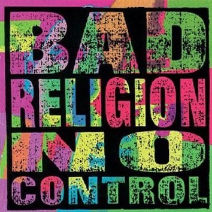

Kuuntelin pitkästä aikaa Bad Religionin No Controlia. Vuonna 1989 ilmestynyt punkrockin klassikko oli teini-iässä yksi suosikkejani. Jälkeenpäin ajateltuna sillä oli melko suuri vaikutus omaan ajatteluuni, vaikka en sitä silloin tiennyt. Ja kun nyt kuuntelin sen pari kertaa peräkkäin, huomasin asian joka oli aiemmin mennyt enimmäkseen ohi; levyn keskeiset biisit toimivat yllättävän tarkasti samalla logiikalla kuin Friedrich Hayekin klassikko *The Fatal Conceit*.

Hayekin kirja, suomeksi *Kohtalokas ylimieli: sosialismin virhepäätelmät*, ilmestyi vuotta ennen *No Controlia*. Sen ydin on yksinkertainen: kulttuuri, kieli, moraali ja markkinat ovat syntyneet spontaanisti, eivät suunnittelijan pöydällä. Niiden uudelleenrakentaminen epäonnistuu, koska järjestelmässä on hiljaista ja hajautunutta tietoa, jota suunnittelijalla ei ole. Juuri uskoa ihmisjärjen kykyyn suunnitella monimutkaisia järjestelmiä Hayek kutsuu kohtalokkaaksi ylimieleksi.

*No Controlin* nimibiisi avaa saman ajatuksen:

> Culture was the seed of proliferation, but it's gotten melded  
> into an inharmonic whole  
> Consciousness has plagued us and we cannot shake it  
> though we think we're in control

Maanviljelyn oppiminen muutti kulttuuria. Paikalleen asettuminen kasvatti populaatioita ja eriytti työnjakoa. Tavoista muodostui instituutioita. Ihmisten ratkaisuista kasvoi spontaani järjestys, jota kukaan ei suunnitellut. Tietoisuus tuottaa harhan, että tällainen järjestys olisi hallittavissa. Kertosäkeessä sama todetaan suorimmin: we have no control, we do not understand.

Levyn poliittisin versio samasta ajatuksesta on "I Want to Conquer the World". Köyhyyden poistaminen, maailmanrauha ja saasteiden vähentäminen ovat hyviä tavoitteita, eikä biisi pilkkaa niitä. Pilkka kohdistuu siihen, kun näiden tavoitteiden saavuttaminen alkaa vaatia maailman valloittamista.

> And I wanna conquer the world  
> Give all the idiots a brand-new religion  
> Put an end to poverty, uncleanliness, and toil  
> Promote equality in all of my decisions

Siinä on Hayekin varoitus poliittisessa muodossa: ihminen näkee kärsimystä, päättelee kokonaisuuden olevan väärin rakennettu, ja uskoo pystyvänsä rakentamaan järjestelmän, joka korjaa kaikki ongelmat. Kertosäkeen ironia rakentuu sille, että kaikki päämäärät ovat kivoja, mutta verbi on valloittaa. Ja se, että pelastettavat ovat idiootteja joille tarjotaan uusi uskonto, paljastaa pelastajan oman asenteen.

"Progress" kertoo nimensä mukaisesti edistyksestä, punkrockin tyyliin.

> Progress is not intelligently planned  
> It's the facade of our heritage  
>   
> Progress is a synonym of time  
> We are all aware of it but it's nothing we refine

Edistys ei ole suunnitelman toteuttamista vaan evolutiivinen prosessi. Sitä voi ohjata paikallisesti, sääntöjen ja instituutioiden tasolla, mutta kokonaisuus ei ole kenenkään hallinnassa. Tämä on Hayekilaista skientismin kritiikkiä punkrockin kolmella soinnulla: usko siihen, että edistystä voitaisiin suunnitella kuin koneen rakentamista on harhakuvitelma.

"Automatic Man" muistuttaa, että spontaani järjestys tuottaa myös tyhmiä ja epätoivottuja tuloksia:

> He's the quintessential, mindless, modern epicene  
> His opinions are determined by the status quo

Biisin idea on siinä, että sama rakenne joka mahdollistaa vapauden ja hyvinvoinnin tuottaa myös kulutuskulttuurin, statusjahdin ja yksilöllisyyden, jonka ryhmäidentiteetti ostetaan pakettina.

## Ahdistus pyörittää järjestelmää

"Anxiety" diagnosoi mekanismin joka pitää koko logiikkaa pystyssä:

> Anxiety destroys us, but it drives the common man  
> Foundation of society, anxiety

Ja:

> What are we angry for? We all need a common cure  
> That common goal for which you strive  
> To have more than the other guy

Tämä pakkaa Fred Hirschin *Social Limits to Growth* (1976) -kirjan tematiikan aika hyvin muutamaan riviin. Yhteinen tavoite ei ole oikeasti yhteinen. Markkinakilpailu, jota Hayek puolusti hajautetun tiedon koordinaatiomekanismina, tuottaa myös statuskilpailun, jossa kaikki eivät voi voittaa. Määritelmän mukaan. Ahdistus on tämän nollasummapelin jakojäännös.

## Musta aurinko nousee

Levy päättyy "The World Won't Stop Without You" -biisiin, joka asettaa kaiken edellisen kosmiseen perspektiiviin:

> Two billion years thus far, now mister, here you are  
> An element in a sea of enthalpic organic compounds  
>   
> The world rotates and will revolve without you constantly

Ihminen on miljardien vuosien prosessin tuottama pieni osanen. Kun sinua ei ole, maapallo jatkaa kulkuaan auringon ympäri kuten ennenkin. Jos olet onnekas, hautajaisiin saapuu 150 ihmistä.

Tämä on Hayekin epistemologisen nöyryyden biologinen pari. Hayek sanoo, että ihmisjärjen ulottuvuus on rajallinen. Luonnontieteellisestä maailmankuvasta ammentava Graffin sanoo, että yhden ihmisen aika on häviävän pieni. Johtopäätös on sama: yritys hallita monimutkaista prosessia perustuu virheelliseen kuvitelmaan omasta merkityksestä järjestelmässä.

## Tämä hetki ja ylimieli

Hayekia luetaan nörttipiireissä ja oikeistolaisissa ajatuspajoissa, ehkä joillain taloustieteen kursseilla. Bad Religionia kuuntelevat punkkarit. Oletus molemmin puolin on, että mitään yhteistä tai opittavaa toiselta puolelta ei ole. Graffinin taustasta luonnontietelijänä  kumpuaa sama epistemologinen nöyryys kuin Hayekilla. Kummankin ajattelun pohjalla on evolutiivisten prosessien hidas vaikutus ja ihmisjärjen rajallisuus.

Eteläkalifornialainen vasemmistopunkkari vuonna 1989 ja itävaltalais-brittiläinen klassinen liberaali vuonna 1988 sanovat samaa asiaa. Joku savolaisoululainen kuuntelee toista ja lukee toista, ja tunnistaa että samoista asioistahan tässä puhutaan.

Kohtalokas ylimieli ei jäänyt 80-luvulle. AI-profeetat julistavat, että kaikki työ loppuu kahdessa vuodessa. Kuntien ilmastotavoitteet lasketaan Viikissä. Amazon huomaa, että hups, työntekijät token-maxaavat. Sairaalan pesulapalvelut kilpailutetaan ja osastolta poistetaan pesukoneet: pitkäaikaisesti sairas lapsi ei saa enää pitää omia tuttuja vaatteitaan. Eduskunta veivaa hoitajamitoitusta edestakaisin, vaikka paras tieto oikeasta tarpeesta on hoitopaikassa.

Lontoon skidit sanoo et ei oo tekemistä muut tietääks ne millaista on Pihtiputaalla?

Sama rakenne toistuu pienemmissä ja suuremmissa päätöksissä: joku luulee tietävänsä paremmin, vaikka rakenne on syntynyt hiljaisesta tiedosta ja ihan syystä.

Turun ratikka on tuore tapaus: kaupunginvaltuusto päätti 18.5.2026 äänin 36–31. Hinta on noussut 465 miljoonaan euroon, ja lopullinen toteutuminen riippuu vielä valtion rahoituspäätöksestä. Kukaan ei tiedä onko päätös hyvä vai huono, koska todellinen hintainformaatio on irroitettu päätöksenteosta.

Kun seuraavan kerran joku kertoo vaikka miten valtion rohkeilla investoinneilla vihreään siirtymään saadaan Suomen talous nousuun, kannattaa ehkä laittaa *No Control* soimaan taustalle. "We have no control / we do not understand" ovat siinäkin kontekstissa järkevimpiä rivejä mitä 80-luvulla kirjoitettiin. Jos Kohtalokas ylimieli on vielä lukematta, sekin kannattaa tsekata.

---

*Lisätietoja:*  
*Friedrich A. Hayek, Kohtalokas ylimieli: sosialismin virhepäätelmät, suom. Joose Norri ja Matti Norri (Art House 1998). Englanninkielinen alkuteos The Fatal Conceit: The Errors of Socialism (University of Chicago Press 1988).*  
*Bad Religion, No Control (Epitaph 1989).*