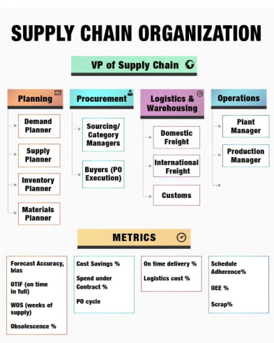

## Organisaatiokaavio joka paljastaa enemmän kuin tekijänsä tarkoitti

Tein logistiikan ja toimitusketjun hommia viitisentoista vuotta.

Se on nuorten laji. Varsinkin LinkedIn-muodossa: rakettiemojit, ketjut ja seitsemän oppia jotka mullistavat toimitusketjusi perjantaihin mennessä.

Enough of that BS.

Olin silti mukana sen aikaa, että erotan yhä sen mikä on roskaa ja mikä ei.

LinkedInissä kiertää parin kuukauden välein infograafi nimeltä "the supply chain organization". Ylimpänä on Supply Chainin VP, alla neljä siiloa: Planning, Procurement, Logistics ja Operations. Kunkin alla on siisti rivi mittarilaatikoita. Otsikko varoittaa, että huono organisaatiokaavio tuhoaa toimitusketjun suorituskyvyn.

Kuva on, tahattomasti, juuri sellainen kaavio.

Sivuutan laatikkohierarkian. Kiinnostavin osa on mittaririvi, ja sen kiinnostavin kohta on hankinnan **Cost Savings %**. Säästöprosentti on ehkäpä toimitusketjun suosituin mittari mutta huonoiten perusteltu.

Väitteeni on yksinkertainen: suuri osa raportoiduista säästöistä on fiktiota, ja iso osa jäljelle jäävästä on markkinaliikettä. Aitoa hankintaosaamista on olemassa. Mittari vain ei useimmiten mittaa sitä.

Operaatiopuolella meillä oli tähän sanonta:

*Heillä on hinnat, meillä on raha.*

## Säästöväite ei ole mittaustulos

Neuvoteltu säästö on väite siitä, mitä olisi tapahtunut ilman neuvottelua. "Säästimme 12 %" tarkoittaa: "maksoimme 12 % vähemmän kuin olisimme muuten maksaneet." Periaatteessa kyse on kontrafaktuaalista.

Käytännössä kontrafaktuaali syntyy usein järjestelmän sisältä: viime vuoden hinnasta, toimittajan avauksesta tai ylhäältä annetusta tavoitteesta. Sama funktio valitsee baseline-lukeman, kirjaa saavutetun tavoitteen ja esittelee diat.

Tavoite on usein tyly: hinnan pitää laskea, tai mukana pitää olla erittäin hyvä selitys.

Yksikään toimitusketjujohtaja ei hyvitä inflaatiota automaattisesti. Yksikään COO ei kuittaa hinnannousua sillä, että energia kallistui kymmenen prosenttia. Markkina teki mitä teki; tavoite pysyy. Toimita, tai selitä.

Hankinta pannaan vastaamaan hintatasosta, jota se ei juuri hallitse. Kun markkina ei jousta, säästön pitää silti ilmestyä. 

Mutta kyllä hätä keinot keksii.

Raportoitava säästö voi löytyä monesta paikasta:

- **Toteutumaton volyymi.** 12 % hankintasäästö kirjataan ennustetta vasten, mutta ostomäärä toteutuu puolikkaana.

- **Kustannusvälttämän pesu.** Toimittaja vaatii +8 %, sovit +3 %, ja hankinta kirjaa "5 % säästöä". Rahaa lähti enemmän kuin viime vuonna, vain vähemmän kuin avausvaatimus antoi ymmärtää. Vältetty kustannus on puolustettavissa, kun vältetty nousu suhteutetaan markkinaan.

- **Ilmapallo.** Yksikköhinta alas, minimieräkoot ylös, rahtiehdot huonommiksi, maksuajat lyhyemmiksi, laatuspesifikaatio löysemmäksi. Hintarivi laskee, mutta kustannus siirtyy paikkaan, jota mittari ei näe.

Se, miten tarina kerrotaan, ratkaisee.

Operaatiolla on taas fyysisen todellisuuden rajoitteista syntyvä kuri. Liikavarasto näkyy käyttöpääomassa. Pitämättömät aikataulut muuttuvat pikarahdiksi, menetetyksi tuotannoksi, myöhästyneiksi toimituksiksi ja menetetyiksi asiakkaiksi. Luvuilla voi yhä pelata, mutta lopulta merkitsevät kappalemäärät, laskut, varaston arvo. Ja raha.

Hankinnan säästöt pysähtyvät usein askelta aiemmin: kalvosettiin, jossa luku julistettiin.

Siksi raportoitu säästö päätyy harvoin ensi vuoden budjettiin oikeana leikkauksena. Jos säästö olisi aito, budjettirivi laskisi saman verran. Näin ei juuri koskaan käy.

Se on paljastava merkki.

## Suurin osa hinnanmuutoksesta on kohinaa

Tähän asti kyse on ollut mittaamisesta. Vaikeampi ongelma on attribuutio. Sellainenkin säästö, joka täsmää rahaan, voi olla enimmäkseen sattumaa.

Ajatellaan hankinnan tulosta signaalina ja kohinana. Signaali on se osa, jota hankinta hallitsee: toimittajavalinta, neuvottelu, sopimusrakenne, kysynnän yhdistely, kaksoishankinta. Kohina on kaikki muu mikä hintaa liikutti: energia, valuuttakurssit, rahtikapasiteetti, raaka-ainesyklit, sota, satamasulut, konkurssit, lakot.

Monessa kategoriassa varianssin määrää kohina. Useimmissa kategorioissa kohina voittaa signaalin. Mittari palkitsee silti vuosimuutoksen. Hintamuutoksen syynä oli markkinat, ei ostaja.

Sijoitustermein suurin osa hankinnan säästöistä on beetaa. Ne ovat altistusta markkinaliikkeelle. Alfa on se, mikä jää jäljelle kun markkinaliike on poistettu.

Teräs halpenee LME:ssä 15 %. Kategoriapäällikkö neuvottelee sopimuksen, hinta seuraa indeksiä alas, ja hän toimittaa 12 % säästön. Tuloskortti loistaa. Bonus maksetaan, ja diaesitys kiertää johtoryhmässä esimerkkinä.

Seuraavana vuonna teräs kallistuu 15 %. Sama päällikkö, sama osaaminen, samat neuvottelut. Hinta seuraa indeksiä ylös. Nyt hän menettää 8 % ja kirjoittaa kappaleen geopoliittisista vastatuulista. Balanced scorecard menee punaiselle, ja seuraa keskustelu kehittämiskohteista.

Mikään hänen tekemisessään ei muuttunut vuosien välillä. Ensimmäisenä vuonna hänelle maksettiin bonus kustannussäästöistä. Toisena häntä moitittiin nousevista kustannuksista. Kummassakin tapauksessa palkittiin tai rangaistiin markkinaliikkeestä, johon ei juuri pystynyt vaikuttamaan.

Pahempaa vielä: se päällikkö joka teki parasta työtä — lukitsi hintoja etukäteen, hajautti toimittajat, suojasi nousua vastaan — näyttää heikoimmalta juuri sinä vuonna jolloin hänen työnsä oli arvokkainta. Bonus on käytännössä pitkä positio laskevaan teräkseen. Sitä maksetaan vedosta jota kukaan ei tietoisesti tehnyt.

Sama osaaminen, päinvastainen kehityskeskustelu.

Mittaat vuorovettä ja palkitset uimarin.

Rehellinen vertailukohta ei ole viime vuoden hinta, vaan tämän vuoden markkinahinta samalle tavaralle. Osaaminen näkyy siinä, mitä maksoit suhteessa siihen mitä vertailukelpoinen ostaja maksoi vastaavin ehdoin samoissa oloissa. 

Päihititkö vertailuindeksin? Pidittekö sopimuksista kiinni kun spot piikitti? Neuvotteliteko uudestaan, kun markkina romahti?

Se on signaalia. Usein se on muutama prosenttiyksikkö indeksin ympärillä, ei kaksinumeroinen otsikkoluku. Hyvä hankinta on todellista, mutta sen kontribuutio on ylituotto markkinaan nähden.

## Vastaesimerkki joka todistaa mallin

Tässä kohtaa hankintaihminen nostaa käden ja sanoo: minä kerran tein oikeasti rahaa ajoituksella.

Hyvä. Se tarina todistaa mallin.

Vuoden 2008 romahduksen jälkeen rahtimarkkina oli pohjalla. Varustamot olivat epätoivoisia täyttääkseen kapasiteettia. Olin yhä operaatiopuolella, mutta käytännössä rakensin tarjouspyynnön ja ajoituksen. Lukitsimme tärkeimmät rahtireitit vuodeksi sopimuksella, ehdoilla jotka olivat poikkeuksellisen edulliset.

Osa piti neuvotella matkan varrella uusiksi. Silti vuoden ajan maksoimme rahdista alle markkinan, ja se näkyi laskuissa jotka talousosasto pystyi tarkastamaan.

Tapaus läpäisee jokaisen testin.

- **Se täsmäsi rahaan.** Lukittu hinta, sopimus ja vuosi oikeita rahtilaskuja alle markkinan.

- **Se oli indeksisuhteista ylituottoa.** Markkinromahduksen jälkeen kaikki eivät maksaneet samoja hintoja.

- **Mekanismi oli osaaminen.** Tarjouspyynnön muotoilu, ajoitus ja uskallus sitoutua pitkään kun muut olivat halvaantuneita. Vastapuolen epätoivo käännettiin sopimusrakenteeksi. 

Se on hankinnan alfaa.

## Aito hankinnan alfa on optio

Rehellinen malli on tämä: keskimääräinen säästö on kohinaa, arvo on hännissä, ja hännät ovat optioluonteisia.

Suurimman osan vuodesta ylituotto indeksiin on muutama piste suuntaan tai toiseen. Hyödyllistä, mutta harvoin kunniakierroksen arvoista. Sitten avautuu häiriö: 2008 jälkeinen rahti, korona-ajan alun kapasiteetti, energiapiikki, toimittajan konkurssi, äkillinen kysynnän romahdus. Terävä ostaja voi kääntää tilapäisen epäjärjestyksen sopimukselliseksi eduksi.

Osaaminen on ikkunan tunnistamista ja mandaattia toimia. Se on harvinaista, koska ikkuna on harvinainen. Pitkä kiinteä sopimus ei ole ilmainen optio. Se voi mennä pieleen, jos markkina jatkaa laskuaan. Siksi se vaatii harkintaa, valtuutta ja riskinottohalua.

Tämä on talebilainen rakenne. Hankinnan alfaa ei voi aikatauluttaa kvartaaleihin.

Vakiomittari ei pysty tähän. Se palkitsee tylsät kvartaalit kuin ne olisivat osaamista ja saattaa ohittaa sen yhden kaupan jolla oli oikeasti väliä.

Tästä seuraa kolme asiaa:

1. Mittari palkitsee tason, vaikka sen pitäisi palkita indeksisuhteinen ylituotto.
2. Sama mittari ei toimi missään olosuhteissa: tyynellä markkinalla se kannustaa keksimään fiktiivisiä säästöjä, myrskyssä se hukkaa aidon osaamisen markkinaliikkeen alle.
3. Aito osaaminen on konveksia ja episodista.

## Kontrolli joka palauttaa rahan keskusteluun

Korjaus on tylsä, kuten parhaat korjaukset yleensä.

Säästö lasketaan vasta kun talousosasto poistaa vastaavan summan budjetista tai todentaa sen toteutunutta kulutusta vasten. Kirjatun säästön pitää muuttua vähemmäksi käytettäväksi rahaksi. Siihen asti se on väite.

Hankinta vihaa tätä, luonnollisesti, koska se muuttaa otsikkomittarin tarinasta luvuksi jonka operaatiot voivat tarkastaa. Kontrolli on vain alkuperäinen sanonta muodollisena:

*Se jolla on raha, saa vahvistaa säästön.*

Sääntö tappaisi suurimman osan hankinnan säästödioista.

Hyvä. Eloonjääneet olisivat lukemisen arvoisia.

Sama pätee attribuutioon. Hankinta tulee mitata markkinaa vasten, ei edellisvuotta vasten.

Ero indeksiin kertoo uiko joku muita paremmin.
