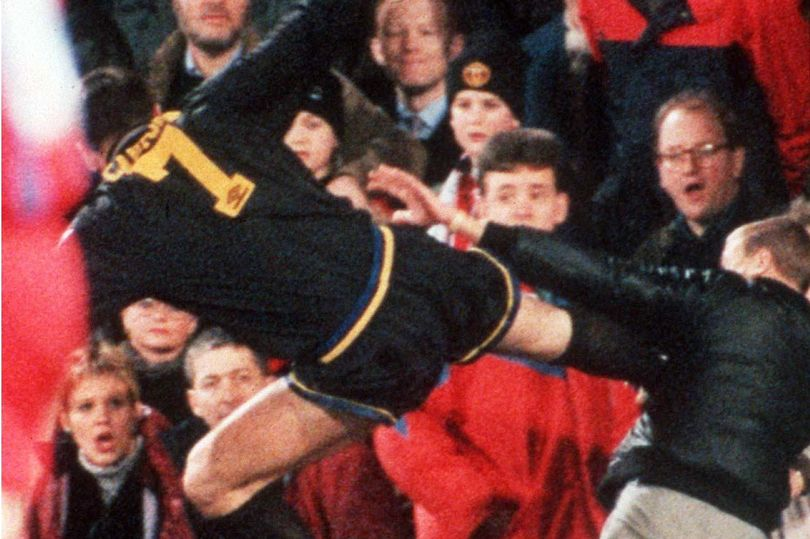

Oulun yliopiston laskentatoimen professori Juha-Pekka Kallunki tutkimusryhmineen on dokumentoinut, että suomalaisten ja ruotsalaisten pörssiyhtiöiden johdossa rikostaustat eivät ole harvinaisuus. Ruotsalaisaineistossa rikostuomio oli noin joka kolmannella johtajalla.[^kallunki-swe] Suomessa noin viidenneksellä pörssiyhtiöiden toimitusjohtajista ja hallituksen jäsenistä oli tuomio taustallaan.[^kallunki-fin]

Rikostausta näkyy seurauksissa, joita omistajat eivät tavallisesti toivo: suurempia liikearvon alaskirjauksia, heikompaa kirjanpidollista varovaisuutta, suurempaa konkurssiriskiä. Kallungin tulkinta on, että rattijuopumus, väkivaltarikos tai muu tuomio voi toimia proxynä piirteille, jotka merkitsevät yritykselle riskiä: impulsiivisuudelle, riskihakuisuudelle ja heikolle itsehillinnälle. Suositus seuraa tästä melko suoraan: pankki- ja vakuutusalan kelpoisuustarkastuksia pitäisi laajentaa muillekin toimialoille.

Suositus olettaa, että ongelma on tiedon puute. Omistajat eivät palkkaisi riskijohtajia, jos he tietäisivät paremmin.

Ammattijalkapallon siirtomarkkinoita voi käyttää stressitestinä oletukselle.

## Markkinat, joilla luonneriskit ovat julkisia

Luis Suárez puri Otman Bakkalin olkapäätä Ajaxin pelaajana vuonna 2010. Hän puri Branislav Ivanovićia Liverpoolin pelaajana vuonna 2013. Hän puri Giorgio Chielliniä MM-kisoissa vuonna 2014. Chiellini-tapauksen jälkeen Barcelona maksoi hänestä noin 80 miljoonaa euroa. Atlético Madrid otti hänet vielä myöhemmin, vaikka hänen historiansa oli kaikkien tiedossa.

Mario Balotelli joutui Manchester Cityssä selvittämään tikkavälikohtausta harjoituskeskuksessa, sytytti kotinsa kylpyhuoneen ilotulitteilla ja ajautui toistuvasti otsikoihin asioista, jotka eivät liittyneet pelisuorituksiin. Silti Inter myi hänet Cityyn, City Milaniin, Milan Liverpooliin, Liverpool takaisin Milaniin. Jokainen ostaja tiesi, mitä oli ostamassa.

Joey Bartonilla oli taustallaan pahoinpitelytuomioita, pelikieltoja ja pelikaverin silmään tumpattu sikari. Newcastle, QPR, Marseille ja Burnley vuorollaan palkkasivat hänet.

Informaatio on kaikkien saatavilla ja taustatarkistus voidaan tehdä julkisista lähteistä. YouTube, Google-haku ja entisten seurojen pukukoppitarinat riittävät pitkälle.

Silti tällaiset pelaajat kelpaavat seuroille kalliilla hinnoilla.

## Miksi tieto ei riitä

Taustatieto voi olla kaikkien nähtävillä ja päätös silti ymmärrettävä. Suárez ostetaan maalien takia ja puremisalttius kuuluu pakettiin.

Tappio ei silti rajoitu siirtosummaan ja palkkaan. Riskipelaaja voi kuluttaa pukukoppia, heikentää valmentajan auktoriteettia, viedä peliaikaa vakaammilta pelaajilta, ärsyttää kannattajia ja tehdä koko seurasta epävakaamman. Osa näistä kustannuksista näkyy kirjanpidossa huonosti. Osa näkyy vasta viipeellä. Osa jätetään seuraavan valmentajan tai urheilujohtajan ratkaistavaksi.

Siksi päätöksentekijän kannustin ratkaisee. Riskihankinnan onnistuminen tuottaa nopean urahyödyn: mainetta rohkeana rekrytoijana, parempaa neuvotteluasemaa, uuden sopimuksen, ehkä mestaruuden. Epäonnistuminen leviää hitaammin ja laajemmalle: menetetty kausi, kulunut pukukoppi, alaskirjaus omistajan taseessa, kannattajien kyllästyminen. Päätöksentekijä ei aina maksa samaa laskua kuin seura.

Tässä jalkapallo testaa Kallungin suosituksen taustaoletusta. Jos ongelma olisi pelkkä tiedon puute, julkinen riskihistoria pysäyttäisi kaupan. Markkinat voivat nähdä riskin aivan oikein ja silti ottaa sen, koska hyöty ja haitta eivät kohdistu samoille ihmisille samalla aikataululla.

Osa varoitusmerkeistä kertoo todellisista ongelmista. Väkivalta, kurittomuus, päihdeongelmat ja jatkuva arjen hallitsemattomuus voivat tuhota enemmän kuin lahjakkuus korvaa. Niiden romantisointi on halpaa jälkiviisautta.

Huippu-urheilussa asia ei kuitenkaan aina ole näin siisti. Sama piirre voi näkyä kahteen suuntaan. Suárezin pakonomainen tarve voittaa jokainen kaksinkamppailu teki hänestä poikkeuksellisen hyökkääjän. Balotellin välinpitämättömnyys seurauksista saattoi auttaa rangaistuspotkuissa, mutta aiheuttaa ongelmia arjessa. Cantonan uhmakkuus taas oli osa hänen karismaansa. Sama piirre sai hänet myös hyppäämään katsomoon.

Pörssiyhtiössä asetelma on toinen. Toimitusjohtajan arvo syntyy oikeista päätöksistä ja luottamuksen rakentamisesta. Yhtiö tarvitsee johtajalta kykyuä rakentaa omistaja-arvoa pitkäjänteisesti.

Siksi jalkapallo ei kumoa Kallungin suositusta.Pörssiyhtiössä hyvä päätös on harkittu päätös, ja taustatarkistus auttaa harkintaa. Jalkapallossa ennalta-arvaamattomuus voi olla arvo sinänsä.

[^kallunki-swe]: Tutkimusryhmän aiemmat ruotsalaisaineistoon perustuvat julkaisut, mm. Amir, E., Kallunki, J-P. & Nilsson, H. (2014), "The Association between Individual Audit Partners' Risk Preferences and the Composition of their Client Portfolios", *Review of Accounting Studies* 19(1), s. 103–133. Ruotsalaisten pörssiyhtiöiden toimitusjohtajista 33,1 prosentilla todettiin rikostuomio. Tulosta referoitu mm. Ylen uutisessa 23.8.2021.

[^kallunki-fin]: Kallunki, J-P., Korkka-Knuts, H., Kallunki, J. & Aaltonen, M. (2023), "Suomalaisten pörssiyhtiöiden ylimmän johdon rikostuomiot ja niiden vaikutus yhtiön rikosoikeudellisille vastuuriskeille", *Oikeus* 1/2023, s. 8–25. Aineisto: 2 201 toimitusjohtajaa, hallituksen jäsentä ja hallituksen puheenjohtajaa suomalaisissa pörssiyhtiöissä 2000–2019. Verrokkina mainittakoon, että korkeakoulutetuista suomalaisista miehistä noin 23,7 prosenttia on tuomittu rikoksesta ennen 54 vuoden ikää, joten pörssijohtajien osuus on itse asiassa hieman verrokkiväestöä alempi.
