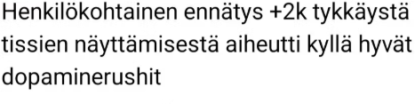
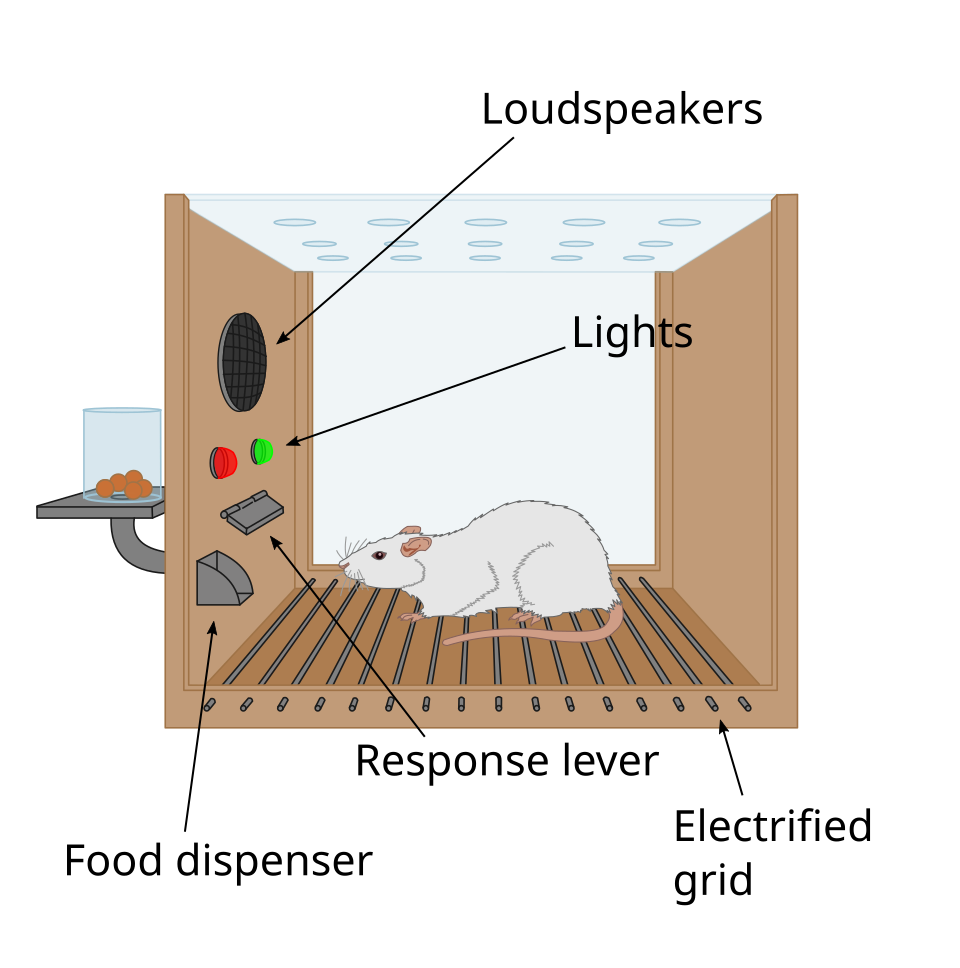
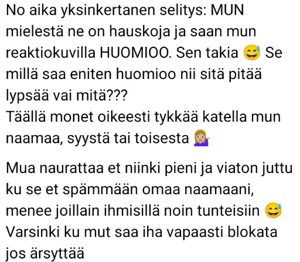

Avasin Threadsin ja vastaan tuli sarja postauksia, joita juuri kukaan ei olisi tehnyt vielä parikymmentä vuotta sitten. Henkilökohtaisia paljastuksia, kehonkuvaprojekteja, yksityiselämän noloja yksityiskohtia. Kaikkien nähtävillä ja tehty tykkäysten toivossa. Aikaisemmin ajattelin, että helvetissä ainoa some on LinkedIn. Threads teki helvetistä tarpeettoman ja ilmiö pakottaa kysymään Greg Graffinin tyyliin *more a question than a curse — how could hell be any worse*. Vilpittömänä kysymyksenä. Miten tähän tultiin?

Helppo selitys olisi, että somen käyttäjäkunta on muuttunut. Vanhempi internet — IRC, Usenet, foorumit — opetti tiettyjä asioita. Että netti on julkinen ja nimimerkkiä kannattaa käyttää. Jos sanot jotain typerää, joku sanoo sen sinulle. Ehkä karkeasti, mutta se voi samalla olla myös välittämistä. Facebookin kautta someen tulleet ohittivat tämän koulutuksen kokonaan. He oppivat someksi sen, jossa nimi ja kasvot ovat etusivulla ja yleisö on lähipiiri.

Demografia on muuttunut — IRC:iä ja Usenetiä käyttivät nörtit ja yliopistotyypit. Tämä ei kuitenkaan riitä selitykseksi. Juttuja, joita ennen olisi pidetty noloina postaavat Threadsiin myös tekniikan tohtorit ja toimitusjohtajat. Taustalla on mekanismi, joka ei selity käyttäjien kognitiivisellä kyvykkyydellä tai sen puutteella.

## Mekanismi

B.F. Skinner tutki 1930-luvulta alkaen operant conditioning -kammiota, jota kutsutaan myös Skinnerin häkiksi. Eläin painaa vipua, saa palkkion. Yksinkertaista. Mielenkiintoinen löydös tuli, kun Skinner alkoi muutella palkkion ajoitusta. Satunnaisesti tuleva palkkio — *variable ratio reinforcement* — tuottaa kompulsiivista käytöstä, jonka houkutusta on vaikea vastustaa. Sama mekanismi tekee uhkapeleistä koukuttavia.

Some-feedit on rakennettu tällä logiikalla, ja tästä ovat kertoneet myös Piilaakson insinöörit. Tristan Harris, Googlen entinen *design ethicist* ja Center for Humane Technologyn perustaja, on kutsunut älypuhelinta "taskussa olevaksi hedelmäpeliksi" (*slot machine in your pocket*). Hänen mukaansa pull-to-refresh -ele on mekaanisesti identtinen yksikätisen rosvon vivun vetämisen kanssa: et tiedä mitä saat, ja juuri siksi vedät uudestaan. Chamath Palihapitiya, Facebookin entinen Growth-yksikön johtaja, on sanonut saman karummin: "short-term, dopamine-driven feedback loops are destroying how society works."

Somet kehittäneet insinöörit tiesivät tämän ja sovelsivat kuusikymmentä vuotta vanhaa psykologian tutkimustietoa. Se toimi.

## Kannustinrakenne ja  aikahorisontti

Somessa käyttäjä saa palkkion välittömästi: dopamiinipiikki, validointi, samaistumiskommentit. Kustannukset realisoituvat hitaasti ja epävarmasti. Kollegat, sukulaiset, tulevat työnantajat ja mahdolliset asiakkaat lukevat ja muistavat. Kukaan ei välttämättä sano mitään ääneen, mutta sosiaalinen maine muokkautuu.

Tämä on klassinen kannustinongelma. Palkkio on välitön ja konkreettinen, kustannus viivästetty ja abstrakti. Sama logiikka kuin päihteissä, pikavipeissä tai vaikka sokerissa. Rationaalinenkin toimija, joka tietää nämä mekanismit teoriassa, päätyy käyttäytymään samalla tavalla, koska palautesilmukka on suunniteltu niin. Lyhyen aikavälin signaali peittää pitkän.

## Varhainen internet ja peelo

Vanhassa suomalaisessa internetissä oli oma sana niille, jotka eivät osanneet käyttäytyä: peelo. Sana viittasi henkilöön, joka rikkoi tahallisesti tai tahattomasti yhteisön konventioita — kirjoitti capslockilla, ei tajunnut huumoria, kysyi FAQissa jo vastattuja kysymyksiä, lainasi koko edellisen viestin vaikka kommentoi vain yhtä riviä. Peeloksi nimeäminen oli julkinen sosiaalinen sanktio. Se palveli yhteisön normien ylläpitoa: opi tavat tai poistu.

Sanan etymologia on jännä. Pekka Elo (1949–2013) oli opetusneuvos, Kouluhallituksen ja sittemmin Opetushallituksen ylitarkastaja, Ylioppilastutkintolautakunnan jäsen ja Suomen Humanistiliiton puheenjohtaja. Siis epäilemättä oppinut mies. Hänen Freenet-tunnuksensa oli "peelo" — etunimien ja sukunimen alkukirjaimet. Internetin keskusteluissa isot kirjaimet ja välimerkit tuottivat kuitenkin hänelle ongelmia. Eräänä päivänä hän valitsi Freenetin valikosta vaihtoehdon, joka heitti hänet vahingossa #freenet-kanavalle IRCissä. Sieltä syntyi kanavalaisten raivo, ja hänen tunnuksestaan tuli haukkumasana. Skrolli-lehti selvitti tätä keväällä 2024 ja päätyi pitämään tarinaa uskottavana.

Tarinan sanoma on vähän epäreilu, mutta valaiseva. Elo oli sivistynyt humanisti, joka kirjoitti elämänkatsomustiedon oppikirjoja ja edusti UNESCOa. Hänet leimattiin, koska hänellä oli hankaluuksia tekstieditorin käytön kanssa, ja ei ehkä lukenut sen aikaisen internetin sosiaalista normistoa oikein. Vanhan internetin yhteisö ei aina osannut erottaa teknistä osaamattomuutta sisällöllisestä typeryydestä, ja osasi olla myös aika julma. Vertaisten antama palaute kuitenkin toimi. Se tuotti oppimista, koska tyhmästä käytöksestä joutui maksamaan mainekustannuksen heti.

Tämä korjausmekanismi toimi, koska se täytti kolme ehtoa. Se tuli vertaisilta eli ihmisiltä joiden mielipide painoi. Se oli julkinen eli muutkin oppivat. Ja se osui samaan kontekstiin missä virhe oli tehty, eli yhteys teon ja seurauksen välillä oli ilmeinen.

Algoritmisesti kuratoitu feed rikkoo kaikki kolme ehtoa kerralla. Postaus ei näy ensisijaisesti niille, jotka tuntevat postaajan hyvin ja voisivat sanoa "älä laita tällaista", vaan tuntemattomille, jotka reagoivat tunnepohjaisesti. Negatiivinen palaute ei saa näkyvyyttä, koska se tuottaa vähemmän engagementia kuin positiivinen, joten kollektiivista oppimista ei tapahdu. Palkkion saa heti, mutta sosiaalinen kustannus tulee viipeellä.

Lopputulos on ennustettava. Feed täynnä ihmisiä, jotka kertovat tuntemattomille asioita, joita ennen kerrottiin korkeintaan parhaalle ystävälle oluttuopin äärellä. Ympäristö on muuttunut niin, että peeloksi nimeäminen on muuttunut taloudellisesti kannattamattomaksi alustalle. Vanhassa systeemissä yhteisö valvoi normeja vapaaehtoistyönä. Uudessa systeemissä alustalla on aktiivinen intressi siihen, ettei kukaan koskaan kutsu toista peeloksi.

Tämä on kiinnostava käänne talous- ja kannustinanalyyttisesti. Vanha internet oli kallis ylläpitää sosiaalisesti — yhteisö moderoi, sieti konflikteja, antoi palautetta. Mutta se tuotti oppimista. Algoritmi-feed poistaa tämän kustannuksen alustalta ja siirtää sen käyttäjälle. Lasku tulee oman sosiaalisen pääoman muodossa, ehkä vuosien viipeellä.

## Threads-käyttäjä ei ole Skinnerin pulu

Skinnerin pulut eivät tietenkään ymmärtäneet olevansa koeasetelmassa. Ne painoivat vipua koska se tuntui hyvältä. Threads-käyttäjällä olisi mahdollisuus ymmärtää, mutta usein hän ei edes halua.

## Lähteitä ja jatkoluettavaa

- Tristan Harris, Center for Humane Technology — [humanetech.com](https://www.humanetech.com)
- Harris, T. (2016). *How Technology is Hijacking Your Mind*. Medium.
- *The Social Dilemma* (2020), ohj. Jeff Orlowski. Netflix-dokumentti.
- Palihapitiya, C. (2017). Stanford GSB -puhe palautesilmukoista.
- Skinner, B. F. (1953). *Science and Human Behavior*. Macmillan.
- Schüll, N. D. (2012). *Addiction by Design: Machine Gambling in Las Vegas*. Princeton University Press.
- Linja-aho, V. (2024). "Peelo-sanan historiasta." *Skrolli*, kesäkuu 2024.
- Viznut, "Ajatuksia syyskuun kymmenentenätuhantena" — [viznut.fi](http://viznut.fi/texts-fi/10000-fi.html)
- Brunton, F. (2013). *Spam: A Shadow History of the Internet*. MIT Press. (Eternal September -ilmiöstä luku 2.)
