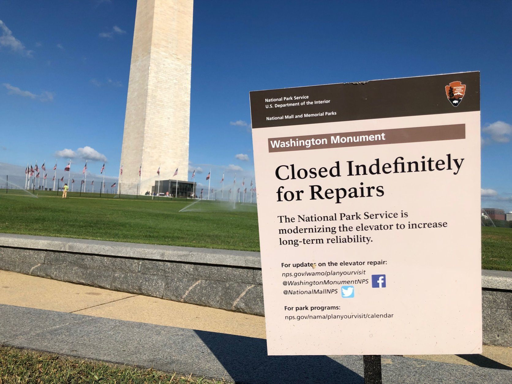

Tilastokeskus ilmoitti toukokuun alussa harkitsevansa vaalitilastojen lakkauttamista. Taustalla ovat Tilastokeskuksen toimintamenoihin vuosina 2025–2027 kohdistuvat noin kuuden miljoonan euron rahoitusleikkaukset, jotka pakottavat arvioimaan uudelleen kaikkea EU-tilastolainsäädännön ulkopuolista kansallista tilastotuotantoa. Suomen vaalitutkimuskonsortio (Helsingin yliopisto, Tampereen yliopisto, Åbo Akademi) on antanut asiasta tyrmäävän lausunnon: yhdessäkään länsimaisessa demokratiassa ei ole lakkautettu virallisia vaalitilastoja, ja konsortio kysyy, mihin viiteryhmään Suomi tämän jälkeen asemoituu.

Miksi juuri vaalitilastot? Tilastokeskus tuottaa satoja erilaisia tilastosarjoja. Leikkauslistalle valitaan se, jonka lakkauttaminen takuuvarmasti aiheuttaa kohun, herättää vaalitutkijoiden vastalauseet ja päätyy Hesarin ja Ylen otsikoihin sekä kansainväliseen huomioon epätavallisena demokratiakysymyksenä.

Ilmiö on tunnettu, ja sille on nimi: Washington Monument syndrome.

## Washington Monument -syndrooma

Termi syntyi 1980-luvulla. Reaganin hallinnon budjettineuvottelujen aikana Yhdysvaltain National Park Service vastasi ehdotettuihin määrärahaleikkauksiin ilmoittamalla, että jos leikkaukset toteutuvat, ensimmäisten suljettavien kohteiden joukossa on Washington Monument. Eli pääkaupungin näkyvin maamerkki, jota miljoonat turistit käyvät vuosittain katsomassa. Viesti tuli selväksi: leikkauksilla on hintansa. Termi on sittemmin vakiintunut public choice -kirjallisuudessa kuvaamaan strategiaa, jossa virasto kohdistaa supistukset tarkoituksellisesti niihin toimintoihin, joiden lakkauttaminen aiheuttaa suurimman kansalaisten vastuksen tai poliittisen kohun.

## Mekanismi

Tilastokeskuksessa tiedetään, mitä virastossa oikeasti tehdään. Eduskunnassa ei välttämättä. Päättäjä näkee budjettirivit ja lakisääteiset tehtävät. Virkamies tietää, mistä työ koostuu ja mitä siitä voi karsia ilman, että kukaan huomaa.

Kun säästöjä on tehtävä, virastolla on kaksi tapaa toimia. Voi karsia sieltä, missä vaikutus ydintehtävään on pieni ja missä ehkä voidaan tehostaa. Säästö syntyy ja juuri kukaan ei huomaa. Tai se voi leikata sieltä, missä leikkauksen vaikutukset tulevat heti esiin.

Tämä on Washington Monument -strategian ydin. Leikkauskohteeksi valitaan jotain, jolla on käyttäjiä, puolustajia ja symbolista arvoa.

Vaalitilastot ovat Washington Monument -logiikan kannalta lähes täydellinen kohde. Ne eivät kuulu EU:n pakolliseen tilastotuotantoon, joten niitä voidaan periaatteessa karsia. Samalla niillä on selvä käyttäjäkunta: vaalitutkijat, puolueet, media ja demokratian tilaa seuraavat kansainväliset vertailut. Niiden lakkauttaminen voitaisiin tulkita myös signaalina siitä, miten Suomi asemoituu tietoon perustuvana demokratiana.

## Iisalmen kirjasto ja 90-luvun lama

Lapsuudenkaupunkini Iisalmen kirjasto teki 1990-luvun laman aikana valinnan, joka jäi mieleeni. Kirjastolla oli lehtilukusali, joka oli koko laitoksen vilkkain osa: eläkeläiset kävivät päivittäin lukemassa Hesaria ja Savon Sanomia, työttömät selasivat työpaikkailmoituksia, koululaiset lukivat MikroBittiä. Kun säästöjä piti tehdä, lehtitilaukset lopetettiin ja lukusali täyttyi ilmaisjakelulehdistä. Kirjoja hankittiin kuten ennenkin. Myös niitä, joita kukaan ei koskaan lainannut.

Lehtilukusalin *pilluuttaminen* aiheutti maksimaalisen näkyvyyden suhteessa siihen, mitä se itse asiassa säästi. Eläkeläiset, työttömät ja koululaiset käyttivät eniten kirjastoa ja heillä oli eniten syytä ja aikaa valittaa. Kenelläkään ei ollut tarvetta valittaa siitä, että hyllyssä oli kirjoja, joita kukaan ei lainannut. Rationaalinen kirjastonjohtaja maksimoi budjettia ja poliittista painetta päättäjiä kohtaan. Loppukäyttäjien kokema hyöty kirjastotoimesta ei ole edes mukana yhtälössä.

Sama logiikka toimii joka tasolla. Oulussa keskustelu peruskoulujen lakkauttamisesta on jokavuotinen rituaali, jossa sivistystoimi nostaa listalle juuri ne koulut, joiden lakkauttaminen herättää eniten vastustusta. Valtuusto perääntyy, ja seuraavalla kierroksella sama leikki alkaa uudestaan.

## Ei vain virastojen ongelma

Olisi virhe pitää Washington Monument -strategiaa pelkästään julkisen sektorin patologiana. Sama logiikka toimii kaikissa organisaatioissa, jotka neuvottelevat resursseistaan ulkoisen rahoittajan kanssa.

Arsenal on hyvä esimerkki. Vuosina, jolloin seura joutui pidättäytymään isoista siirroista – osittain Emirates-stadionin rakennusvelan vuoksi, osittain UEFA:n Financial Fair Play -sääntöjen kiristyttyä – Arsène Wenger valitti budjettirajoituksista toistuvasti tavalla, joka muistuttaa Washington Monument -strategiaa. Cesc Fàbregas Barcelonaan, Robin van Persie Manchester Unitediin, Alexis Sánchez Unitediin. "Olisimme voittaneet mestaruuksia, jos emme olisi myyneet Fàbregasia, Nasria ja Van Persietä", Wenger [totesi FourFourTwolle](https://dailypost.ng/2012/12/12/we-won-trophies-didnt-sell-fabregas-nasri-van-persie-wenger) joulukuussa 2012. Viesti kannattajille ja Stan Kroenkelle oli sama, jonka National Park Service lähetti kongressille: rahoituksen rajoituksilla on hintansa, ja se hinta tullaan maksamaan näkyvimmästä paikasta. Vaihtoehdoista, kuten hallinnosta, scouting-budjetista tai akatemiasta leikkaamisesta ei haluttu puhua, koska ne eivät olisi tuottaneet samaa painetta rahoittajaa kohtaan.

Esimerkkejä riittää. Yliopistot ehdottavat säästöjä suosituimmista oppiaineista ja näkyvimmistä tutkimusryhmistä. Festivaalit uhkaavat peruuttaa pääesiintyjän. Joka kerta valitaan se kohde, joka takaa kovimman metelin.

## Onko tämä ongelma

Kuulostaa pahalta. Virasto painostaa lapsilla, eläkeläisillä tai vaalitilastoilla.

Toinen tapa toteuttaa sama säästö on näkymättömämpi. Karsitaan sellaisista kohteista, joiden rapautuminen näkyy vasta vuosien päästä. Säästötavoitteet saavutetaan ja budjetti tasapainottuu. Aikasarja katkeaa, tilaston laatu heikkenee. Siitä ei kirjoiteta etusivun juttua, koska juttua ei oikeastaan ole.

Washington Monument -strategia ei ole elegantti, mutta se *tuo informaatiota näkyviin*. Se pakottaa päättäjän kohtaamaan leikkauksen seuraukset. Tässä mielessä se on demokraattisen mekanismin korjausyritys.

Ongelma syntyy vasta silloin, kun molemmat osapuolet oppivat pelaaman peliä oikein. Budjettivallan käyttäjä leikkaa enemmän, koska tietää, että virasto liioittelee vaikutuksia. Virasto liioittelee, koska tietää, että muuten leikataan vielä enemmän. Pelin tasapaino siirtyy molempien osapuolten kannalta huonompaan suuntaan. Ja tärkein asia – informaatio leikkauksen todellisista seurauksista – katoaa kohinaan.

## Tilastokeskuksen tapaus

Onko kyse aidosti välttämättömästä leikkauksesta vai signaalista? Voi olla molempia.

Tilastokeskuksen on todella karsittava noin kuuden miljoonan euron edestä, EU-pakkotilastoja ei voi karsia, ja vaalitilastot ovat budjettiin nähden suhteellisen kallis ja ei-pakollinen kohde. Mutta valikoinnissa juuri tämän kohteen nostaminen ehdokkaaksi täyttää kaikki Washington Monument -strategian kriteerit: kohu on taattu, vastustus on äänekästä ja kansainvälinen vertailu on Suomen kannalta nolo.

Vaalitilastoissa on yksi tärkeä ero alkuperäiseen Washington Monumentiin. Suljettu monumentti aukeaa, kun rahaa taas tulee, mutta tilastoimatta jätetty aikasarja katkeaa lopullisesti. Tämä on konsortion lausunnon tärkein virke: "Kun vaalitilastojen pitkät aikasarjat kerran katkeavat, menetettyä tietoa ei saada takaisin."

Jos Tilastokeskus joutuu oikeasti karsimaan kuusi miljoonaa euroa, jokin EU-pakkotilastojen ulkopuolinen kohde joudutaan jättämään pois. Vaalitilastot on siinä mielessä realistinen ehdokas. Mutta listan kärkeen päätyy aina kohde, jonka lakkauttaminen sattuu eniten, ja se ei ole sattumaa. Lopputulos riippuu siitä, miten budjettivallan käyttäjä reagoi: löytyykö rahoitus, vai suljetaanko Washington Monument oikeasti.

Virastojen leikkausstrategioista on kirjoitettu paljon. Yksi alan kuuluisimmmista tutkijoista on suomalaisille varsin tuntematon yhdysvaltalainen ekonomisti William A. Niskanen. Hänestä lisää myöhemmin.